# Mạng máy tính cơ bản
## 1. Tổng quan
Mạng máy tính dưới góc nhìn của người dùng cuối

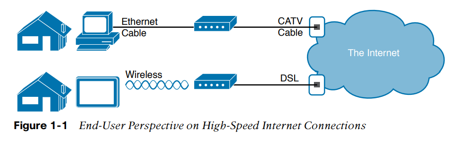

Phần trên của ảnh cho thấy một người dùng Internet tốc độ nhanh. PC được kết nối với cable modem sử dụng cáp Ethernet. Cable modem sau đó được kết nối với ổ cáp TV (CATV) trong tường sử dụng cáp đồng trục (coaxial cable). Vì nhà cung cấp dịch vụ Internet cung cấp dịch vụ liên tục, người dùng có thể sử dụng PC để gửi email, lướt web,...

Phần dưới của hình ảnh sử dụng hai công nghệ khác nhau. Đầu tiên, máy tính bảng sử dụng công nghệ không giây tên là wireless local-area network (wireless LAN), hay Wi-Fi, thay vì sử dụng cáp Ethernet. Trong ví dụ này, router sử dụng một công nghệ khác DSL, để giao tiếp với Internet.

## 2. Mô hình TCP/IP
- Một mô hình networking, đôi lúc được gọi là kiến trúc networking hoặc bản thiết kế networking, là một tập các tài liệu chi tiết. Mỗi tài liệu này mô tả một yêu cầu chức năng cho network; cùng với nhau, những tài liệu này định nghĩa ra **tất cả mọi thứ nên xảy ra để cho một mạng máy tính có thể hoạt động**. Một số tài liệu định nghĩa các **giao thức (protocol)**, là **tập các quy tắc các thiết bị phải tuân theo để giao tiếp. Một số tài liệu khác định nghĩa các yêu cầu vật lý cho networking**. Ví dụ, một tài liệu có thể định nghĩa mức điện áp dùng trên một dây cáp cụ thể khi truyền dữ liệu
- Bạn có thể nghĩ đến mô hình networking như là một bản thiết kế kiến trúc cho một ngôi nhà. Bạn có thể xây nhà mà không cần bản thiết kế, tuy nhiên việc có bản thiết kế sẽ đảm bảo rằng ngôi nhà có nền tảng và cấu trúc chắc chắn và nó sẽ không sụp đổ, và nó sẽ có không gian thích hợp cho ống, điện, gas,... Bên cạnh đó, nhiều người khác nhau cùng xây dựng ngôi nhà cũng sẽ sử dụng bản thiết kế - như là thợ điện, thợ đóng gạch, thợ sơn,... - họ biết rằng nếu như họ tuân theo bản thiết kế, phần của họ sẽ hoạt động và sẽ không gây khó khăn cho các thợ khác.
- Tương tự như vậy, bạn có thể xây dựng network riêng - viết phần mềm riêng, xây dựng network card riêng, ... để tạo ra một network. **Tuy nhiên, việc mua và sử dụng những sản phẩm mà đã tuân theo một mô hình networking phổ biến thì dễ hơn rất nhiều. Vì các nhà bán sản phẩm networking phát triển các sản phẩm theo một mô hình networking nào đó, các sản phẩm của họ sẽ hoạt động tốt với nhau.**

### 2.1 Lịch sử dẫn đến TCP/IP
- Ngày này, thế giới của mạng máy tính sử dụng một mô hình networking: **TCP/IP**. Tuy nhiên, thế giới đã từng phức tạp hơn vây. Ngày xưa, các giao thức mạng không tồn tại, bao gồm TCP/IP. Các nhà cung cấp tạo ra các giao thức networking đầu tiên; những giao thức này chỉ hỗ trợ cho máy tính của họ.
- Ví dụ IBM, công ty máy tính với thị phần lớn nhất trên thị trường trong những năm 1970 và 1980, cho ra mô hình Systems Network Architecture (SNA) vào năm 1974. **Các nhà cung cấp khác cũng tạo ra mô hình networking proprietary. Vì vậy, nếu công ty của bạn mua máy tính từ 3 nhà cung cấp khác nhau, các kĩ sư network sẽ thường phải tạo ra ba network khác nhau dựa trên các mô hình networking tạo ra bởi mỗi nhà cung cấp, và với một cách nào đó kết nối các network đó với nhau, *khiến cho network phức tạp hơn.***

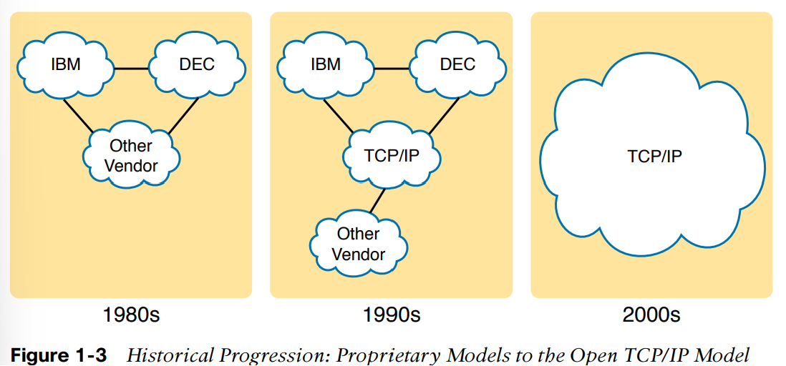

- Mặc dù các mô hình của các nhà cung cấp thường hoạt động tốt, nhưng **một mô hình networking mở độc lập với các nhà cung cấp sẽ giúp giảm độ phức tạp.** Internation Organization for Standardization (ISO) triển khai tạo ra một mô hình như vậy bắt đầu vào cuối 1970, mô hình networking họ xây dựng có tên là **Open Systems Interconnection (OSI). ISO có một mục tiêu với mô hình OSI: chuẩn hóa tất cả các giao thức networking để cho phép giao tiếp giữa tất cả các máy tính trên hành tinh.**
- Một dự án khác bắt nguồn từ Bộ Quốc Phòng Mỹ (U.S Department of Defense (DOD)), cũng nhằm tạo ra một mô hình networking mở. **Các nhà nghiên cứu ở các trường đại học tình nguyện giúp phát triển các giao thức mà Bộ Quốc Phòng Mỹ đã phát triển. Những nỗ lực này dẫn tới việc ra đời của một mô hình networking mở khác gọi là TCP/IP**
- Trong những năm 1990, các công ty bắt đầu thêm OSI, hoặc TCP/IP hoặc cả hai vào mạng doanh nghiệp của họ. Tuy nghiên vào cuối những năm 1990, **TCP/IP đã trở thành lựa chọn mặc định, và OSI dần lụi tàn.**
- Vào thế kỉ 20, TCP/IP thống trị thị trường. Các mô hình networking proprietary vẫn tồn tại, nhưng phần lớn chúng đã bị thay thế bởi TCP/IP. Mô hình OSI, do tốc độ chuẩn hóa chậm hơn TCP/IP; chưa từng thành công trên thị trường. **TCP/IP, mô hình networking được phát triển bởi các tình nguyện viên đã thống nhất thị trường.**
- Khả năng cực kì thấp các bạn phải làm việc trên một máy tính sử dụng các giao thức OSI thay vì TCP/IP. Tuy nhiên, **các thuật ngữ liên quan đến OSI vẫn thường xuyên được sử dụng**

### 2.2 Tổng quan mô hình TCP/IP
- Mô hình TCP/IP **định nghĩa và tham chiếu một tập lớn các giao thức để cho phép máy tính giao tiếp**
- Để định nghĩa một giao thức **TCP/IP sử dụng tài liệu gọi là *Requests For Comments (RFC)* (Bạn có thể tìm RFCs bằng search engine).** Mô hình TCP/IP **tránh việc lặp lại các công việc đã được làm bởi các tổ chức chuẩn hóa khác bằng cách tham chiếu tới các chuẩn hoặc giao thức tạo ra bởi nhóm đó.** Ví dụ, Institute of Electrical and Electronic Engineers (IEEE) định nghĩa Ethernet LANs: mô hình TCP/IP không định nghĩa Ethernet trong RFCs, nhưng có tham chiếu tới IEEE Ethernet.
- Mô hình TCP/IP tạo ra một tập các quy tắc cho phép chúng ta lấy một cái máy tính (hoặc thiết bị mobile) ra khỏi hộp, cắm các dây vào, mở lên, kết nối và sử dụng mạng. Bạn có thể sử dụng web browser để kết nối tới trang web yêu thích, sử dụng úng dụng bạn thích,... tất cả đều hoạt động. Tại sao ? **OS (Operating System - Hệ điều hành) trên máy bạn cài đặt các phần của mô hình TCP/IP. Card Ethernet, hoặc card LAN không dây, trong máy tính cài đặt một vài chuẩn LAN được tham chiếu bởi mô hình TCP/IP. Nói ngắn gọn, *các nhà cung cấp tạo ra phần cứng và phần mềm cài đặt TCP/IP***
- Để giúp mọi người hiểu một mô hình networking, mỗi mô hình sẽ **chia các chức năng thành các danh mục gọi là *layers*.** Mỗi layer có bao gồm các giao thức và chuẩn có liên quan đến chức năng đó, như trong hình đưới

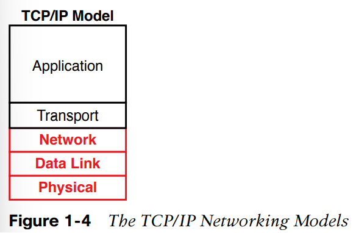

- Mô hình TCP/IP cho thấy các thuật ngữ phổ thông và layers thường được sử dụng khi mọi người nói về TCP/IP ngày nay.
- Physical layer dưới tập trung vào cách truyền bit trên mỗi link.
- Data-link layer tập trung gửi dữ liệu trên một loại link vật lý: ví dụ, network sử dụng các giao thức data-link khác nhau cho Ethernet LANs so với wireless LANs.
- Network layer tập trung truyền dữ liệu từ máy đích đến máy nguồn
- Hai layer trên tập trung vào các ứng dụng cần gửi và nhận dữ liệu

<table>
<tr>
<th>
TCP/IP Layer
</th>
<th>
Các giao thức
</th>
</tr>
<tr>
<td>
Application
</td>
<td>
HTTP, POP3, SMTP
</td>
</tr>
<tr>
<td>
Transport
</td>
<td>
TCP, UDP
</td>
</tr>
<tr>
<td>
Network
</td>
<td>
IP, ICMP
</td>
</tr>
<tr>
<td>
Data Link và Physical
</td>
<td>
Ethernet, 802.11 (Wi-Fi)
</td>
</tr>
</table>

### 2.3 TCP/IP Application Layer
- *Cung cấp dịch vụ cho các ứng dụng chạy trên máy tính.*
- Application layer **không định nghĩa ra ứng dụng** mà **định nghĩa ra các dịch vụ mà ứng dụng cần**.

Ví dụ, giao thức application HTTP định nghĩa cách web browser kéo nội dung của web page từ web server.

**Tóm lại, application layer cung cấp giao diện giữa phần mềm chạy trên máy tính và network**

#### Tổng quan HTTP
Ứng dụng TCP/IP phổ biến nhất hiện nay là web browser. Nhiều nhà cung cấp phần mềm lớn đã hoặc đang thay đổi ứng dụng của họ để hỗ trợ truy cập từ một web browser. Và việc sử dụng web browser rất là dễ: Bạn chỉ cần mở web browser trên máy tính lựa chọn một trang web bằng cách gõ tên của nó, và nó xuất hiện.

Vậy điều gì đang thực sự xảy ra để cho phép trang web xuất hiện trên web browser ?

Tưởng tượng rằng Bob mở browser. Browser của anh ấy đã được cấu hình để tự động yêu cầu trang web mặc định của web server của Larry. Logic giống như hình dưới.

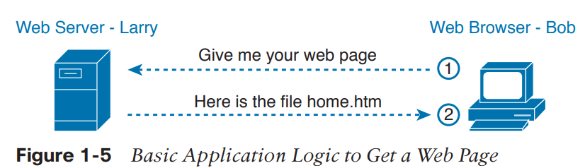

Vậy điều gì đang xảy ra ? Bob yêu cầu Larry gửi home page cho Bob. **Phần mềm web server của Larry đã được cấu hình để biết web page mặc định ở trong một file gọi là home.htm. Bob nhận file của Larry và hiển thị nội dung của file trên cửa sổ web browser.**

#### Cơ chế HTTP
Ví dụ dưới cho thấy cách các ứng dụng ở mỗi máy tính endpoint - cụ thể là, ứng dụng web browser và ứng dụng web server - sử dụng giao thức application layer TCP/IP.

Để yêu cầu một trang web và trả về nội dung của trang web, các ứng dụng sử dụng Hypertext Transfer Protocol (HTTP)

HTTP không tồn tại cho tới khi Tim Berners-Lee tạo ra web browser và web server đầu tiên vào những năm đầu 1990.

*Lưu ý* Phiên bản đầy đủ của địa chỉ web - được gọi là Uniform Resource Locators (URL) hoặc Universal Resource Identifiers (URI) - bắt đầu với *http*, tức là http được sử dụng để truyền các trang web

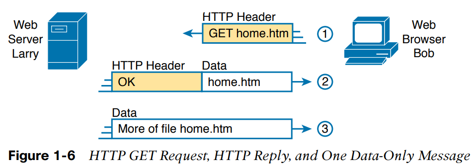

Bước 1: Để lấy web page từ Larry, Bob gửi một thông điệp với một HTTP header. Thường các giao thức sử dụng header làm một nơi để đặt thông tin sử dụng bởi giao thức đó. Header HTTP này bao gồm yêu cầu để "lấy" một file. Yêu cầu sẽ thường chứa tên của file (home.htm trong truòng hợp này), hoặc nếu không có tên file được đặc tả, web server giả dụ Bob muốn web page mặc định

Bước 2: Web server Larry trả về một thông điệp. Thông điệp bắt đầu bằng một HTTP header, với mã trả về (200), trức là "OK". HTTP cũng định nghĩa các mã trả về khác để server có thể nói với browser rằng yêu cầu hoạt động (Một ví dụ khác: Nếu bạn tìm một web page mà not found, bạn sẽ nhận được lỗi HTTP 404, vì bạn nhận được mã trả về HTTP 404). Thông điệp cũng bao gồm phần đầu tiên của file được yêu cầu

Bước 3: Một thông điệp nữa được trả về từ web server Larry tới web browser Bob, nhưng lần này là không có HTTP header. HTTP chuyển dữ liệu bằng cách gửi nhiều thông điệp, mỗi thông điệp là một phần của file. Thay vì phí không gian bằng cách lặp header HTTP, các thông điệp này loại bỏ phần Header.

### 2.4 TCP/IP Transport Layer
**Hai giao thức transport layer được sử dụng nhiều nhất là Transmission Control Protocol (TCP) và User Datagram Protocol (UDP)**

Các giao thức ở transport layer cung cấp dịch vụ tới các giao thức ở application layer. Nó làm điều đó như thế nào ? Phần này giới thiệu khái niệm chung bằng cách tập trung vào một **dịch vụ cung cấp bởi TCP: phục hồi lỗi.**

Để hiểu được giá trị của giao thức ở transport layer, bạn phải nghĩ về tầng ở trên tầng transport, tầng application. Tại sao ? **Mỗi layer cung cấp dịch vụ cho layer trên nó, như TCP cung cấp dịch vụ phục hồi lỗi cho các giao thức ở tầng application**

Ví dụ, trong Hình 1-5, Bob và Larry sử dụng HTTP để chuyển home page từ web server Larry tới web browser của Bob. Nhưng điều gì xảy ra nếu yêu cầu HTTP GET của Bob bị mất trong quá trình truyền qua mạng TCP/IP ? Hoặc điều gì sẽ xảy ra nếu thông điệp trả về của Larry bị mất ? Trong cả hai trường hợp, trang web sẽ không được hiển thị trong browser của Bob

**TCP/IP cần một cơ chế để đảm bảo việc truyền dữ liệu qua một network. Bởi vì nhiều giao thức tầng application muốn một cách đảm bảo việc truyền dữ liệu thông qua mạng, các nhà phát triển ra TCP có tạo ra một tính năng hồi phục lỗi**. Để hồi phục lỗi, **TCP sử dụng khái niệm acknowledgesments.** Hình 1-7 mô tả ý tưởng cơ bản về việc TCP nhận biết được dữ liệu mất và yêu cầu người gửi thử lại

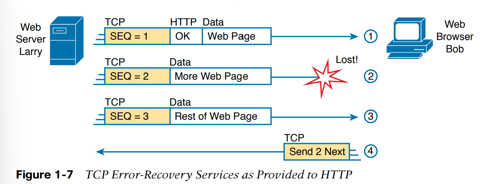

Hình 1-7 cho thấy web server Larry gửi một web page tới web browser Bob, sử dụng 3 thông điệp độc lập. Hình trên có thêm phần header TCP. Phần này bao gồm một sequence number (SEQ) với mỗi thông điệp. Trong ví dụ này, network gặp trục chặc, và network không gửi được thông điệp TCP với sequence number 2. Khi Bob nhận được thông điệp với SEQ 1 và 3, nhưng không nhận được thông điệp với SEQ 2, Bob nhận ra rằng thông điệp 2 bị mất. Nhờ TCP, Bob nhận ra thông điệp bị mất và gửi một TCP segment tới Larry, yêu cầu Larry gửi lại thông điệp 2.

#### Tương tác trong cùng layer và giữa các layer cạnh nhau

Hình 1-7 cũng minh họa một chức năng gọi là **adjacent-layer interaction, là khái niệm mà các tầng cạnh nhau trong một mô hình networking hoạt động với nhau.** Trong ví dụ này, giao thức tầng cao (HTTP) muốn phục hồi lỗi, nên nó sử dụng giao thức ở tầng dưới (TCP) để thực hiện dịch vụ phục hồi lỗi; layer thấp cung cấp dịch vụ cho layer ở trên nó.

Hình 1-7 cũng cung cấp một ví dụ về chức năng tương tự gọi là **same-layer interaction. Khi một layer cụ thể trên một máy tính muốn giao tiếp với cùng layer trên một máy tính khác, hai máy tính sử dụng header để giữ thông tin mà chúng muốn giao tiếp.** Ví dụ, trong Hình 1-7, Larry đặt sequence numbers thành 1,2 và 3 để Bob nhận ra khi một vài dữ liệu chưa tới. Tiến trình TCP của Larry tạo ra TCP header với equence number; tiến trình TCP của bob nhận và phản ứng với TCP segments.

Bảng dưới tổng quát hóa những điểm chính về cách các tầng cạnh nhau hoạt động cùng nhau trên một máy tính và cách một tầng trên một máy tính hoạt động với cùng một tầng ở máy tính khác

<table>
<tr>
<th>
Khái niệm
</th>
<th>
Mô tả
</th>
</tr>
<tr>
<td>
Same-layer interaction trên các máy tính khác nhau
</td>
<td>
Hai máy tính sử dụng một giao thức để giao tiếp với cùng một layer trên máy tính còn lại. Giao thức định nghĩa một header để giao tiếp về việc mỗi máy tính muốn làm gì
</td>
</tr>
<tr>
<td>
Adjacent-layer interaction trên cùng máy tính
</td>
<td>
Trên một máy tính, tầng thấp cung cấp dịch vụ cho tầng ngay trên nó. Phần mềm hoặc phần cúng cài đặt tầng cao yêu cầu tầng ngay dioiws thực thi các chức năng cần thiết.
</td>
</tr>
</table>

### 2.5 TCP/IP Network Layer
Tầng network TCP/IP chứa một số nhỏ các giao thức, **nhưng chỉ có một giao thức lớn: Internet Protocol (IP).** Thực ra, tên TCP/IP là tên của hai giao thức phổ biến nhất (TCP và IP) ngăn cách nhau bởi dấu /

IP cung cấp nhiều chức năng, quan trọng nhất là, **addressing và routing**. Phần này giới thiệu về IP addressing và routing

#### Internet Protocol và Postal Service (Dịch vụ bưu chính)
Tưởng tượng bạn vừa viết hai bức thư: một cho bạn ở bên kia đất nước và một cho bạn ở bên kia thành phố. Bạn ghi địa chỉ lên phong bì, và dán tem lên, cả hai bức thư đều sẵn sàng để có thể đưa cho dịch vụ bưu chính. Có sự khác biệt nào về việc bạn gửi hai bức thư không ? Không. Thường thì bạn sẽ cho chúng vào hòm thư, và giao cho dịch vụ bưu chính để gửi chúng

Tuy nhiên, dịch vụ bưu chính phải xem xét kĩ lưỡng đối với hai bức thư, và đưa ra lựa chọn về địa điểm để gửi mỗi bức thư. Với bức thư gửi bên kia thành phố, nhân viên ở bưu điện chỉ cần cho thư vào một xe tải khác.

Với bức thư phải gửi tới bên kia đất nước, dịch vụ bưu chính phải gửi bức thư tới một bưu điện khác, rồi bưu điện đó lại gửi tới một bưu điện khác, cho tới khi bức thư được chuyển tới nơi. Ở mỗi bưu điện, dịch vụ bưu chính phải xử lý bức thư và quyết định vị trí tiếp theo để gửi.

Dịch vụ bưu chính sẽ có các tuyến đường thông thường cho các xe tải nhỏ; xe tải lớn; máy bay, tàu,... để chuyển thư giữa các bưu điện. Dịch vụ phải nhận được và chuyển tiếp các bức thư, và nó phải đưa ra những lựa chọn phù hợp về địa điểm tiếp theo để gửi thư.

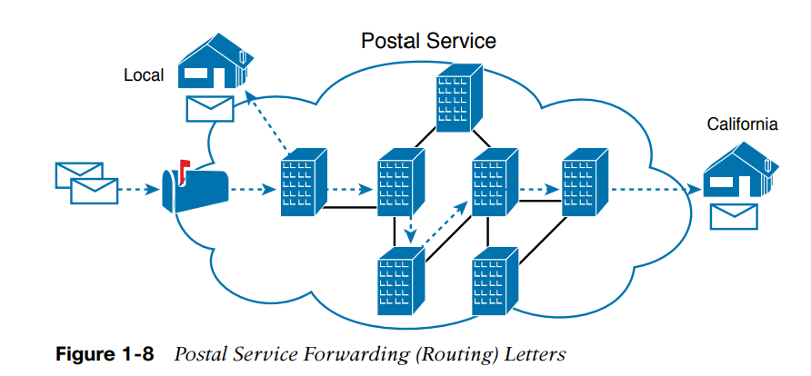

Tiếp tục, xét sự khác biệt giữa người gửi bức thư và công việc của dịch vụ bưu chính. Người gửi bức thư mong đợi dịch vụ bưu chính sẽ gửi bức thư được phần lớn thời gian. Tuy nghiên, họ không quan tâm chi tiết về đường đi mà bức thư đi qua. Ngược lại, dịch vụ bưu chính không tạo ra bức thư, nhưng chấp nhận bức thư từ khách hàng, sau đó, dịch vụ bưu chính phải biết chi tiết về địa chỉ và mã postal và nó phải có khả năng để chuyển bức thư

**Các tầng application và transport TCP/IP giống như người gửi thư thông qua dịch vụ bưu chính. Các tầng trên hoạt động tương tự ngay cả khi các máy tính endpoint trên cùng LAN hoặc ngăn cách nhau qua Internet.** Để gửi một thông điệp, các tầng trên yêu cầu tầng dưới, tầng network, để truyển thông điệp.

**Các tầng thấp của TCP/IP giống như dịch vụ bưu chính vận chuyển các thông điệp tới vị trí đích. Để làm vậy, chúng phải hiểu được mạng vật lý bởi vì chúng phải đưa ra các lựa chọn tốt nhất để vận chuyển dữ liệu từ host này sang host khác**

Vậy điều này có ý nghĩa gì với networking ? **Tầng network của mô hình TCP/IP, phần lớn được định nghĩa bởi Internet Protocol (IP), hoạt động giống như dịch vụ bưu chính.** IP định nghĩa rằng **mỗi máy tính host có một địa chỉ IP khác nhau**, giống như dịch vụ bưu chính định nghĩa rằng mỗi nhà có một địa chỉ khác nhau. Tương tự, **IP định nghĩa quá trình định tuyến để các thiết bị gọi là routers có thể hoạt động giống như bưu điện, chuyển tiếp các package data để chúng có thể được chuyển tới đích.** Giống như dịch vụ bưu chính tạo ra cơ sở hạ tầng cần thiết để vận chuyển thư - bưu điện, máy sắp xếp, xe tải, máy pay,... - **tầng network định nghĩa chi tiết cách cơ sở hạ tầng mạng được tạo ra để network có thể chuyển dữ liệu tới tất cả các máy tính trong network.**

#### Cơ bản về Internet Protocol Addressing
IP định nghĩa địa chỉ vì một vài lý do quan trọng.
- Mỗi thiết bị sử dụng TCP/IP - mỗi TCP/IP host - **cần một địa chỉ độc nhất để nó có thể được định danh trên mạng**
- **IP cũng định nghĩa cách nhóm các địa chỉ với nhau,** giống như hệ thống bưu chính nhóm các địa chỉ dựa trên postal codes

Hình 1-9 minh họa mạng TCP/IP cơ bản

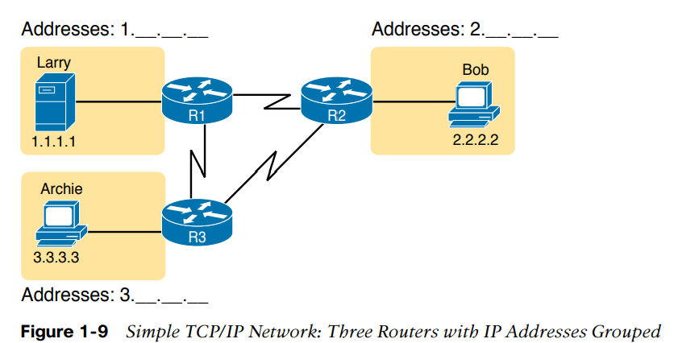

Đầu tiên, Hình 1-9 cho thấy một vài IP address. Mỗi IP address có 4 số, ngăn cách nhau bởi dấu ".". Trong trường hợp này, Larry sử dụng địa chỉ IP 1.1.1.1, và Bob sử dụng 2.2.2.2. Kí pháp này được gọi là dotted-decimal (DDN)

Hình 1-9 giới thiệu IP routers. **Routers là các thiết bị mạng kết nối các phần của mạng TCP/IP với mục đích định tuyến (chuyển tiếp) các IP packets tới địa điểm đúng.** Routers làm công việc tương tự với các bưu điện: **Chúng nhận các IP packets trên các giao diện vật lý, đưa ra lựa chọn dựa trên địa chỉ IP đi kèm với packet, và sau đó chuyển tiếp vật lý các packet tới các giao diện mạng khác**

#### Định tuyến IP cơ bản

Tầng TCP/IP network, sử dụng giao thức IP, cung cấp dịch vụ chuyển tiếp IP packets từ một thiết bị này tới thiết bị khác. **Bất kì thiết bị với địa chỉ IP có thể kết nối tới mạng TCP/IP và gửi packets.** Phần này minh họa ví dụ định tuyến IP cơ bản

*Lưu ý* Thuật ngữ **IP host** nói tới bất kì thiết bị, không quan tâm kích cỡ hay khả năng tính toán, có một địa chỉ IP và kết nối với bất kì mạng TCP/IP

Hình 1-10 mô tả trường hợp thân thuộc trong đó web server Larry muốn gửi một phần web page tới Bob, nhưng với chi tiết liên quan đến IP. Ở phần bên trái, lưu ý rằng server Larry có dữ liệu application, HTTP header, và TCP header sẵn sàng để gửi. Bên cạnh đó, thông điệp bây giờ chứa IP header. IP header bao gồm địa chỉ IP nguồn: địa chỉ IP của Larry (1.1.1.1) và địa chỉ IP đích của Bob (2.2.2.2)

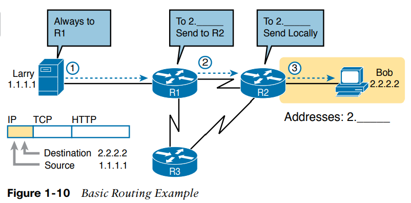

Bước 1, ở bên trái của Hình 1-10, bắt đầu với việc Larry sẵn sàng gửi một IP packet. Tiến trình IP của Larry chọn gửi packet tới một router nào đó - một router ở gần, trên cùng LAN - và mong đợi router sẽ biết cách chuyển tiếp packet (Tương tự với việc bạn gửi thư bằng cho hết vào hòm thư gần nhất). Larry không cần biết gì về topology hoặc các routers khác

Bước 2, Router R1 nhận IP packet, và tiến trình IP của R1 đưa ra lựa chọn. R1 nhìn vào địa chỉ đích (2.2.2.2) so sánh địa chỉ đó với các IP routes, và chọn chuyển tiếp packet tới Router R2. Quá trình chuyển tiếp IP packet được gọi là IP routing (hay đơn giản là routing - định tuyến)

Bước 3, Router R2 lặp lại logic giống như Router R1. Tiến trình IP của R2 sẽ so sánh địa chỉ đích của packet 2.2.2.2 tới các IP routes R2 biết và đưa ra lựa chọn chuyển tiếp packet tới bên phải tới Bob.

### 2.6 TCP/IP Data-Link và Physical Layers
**Tầng data-link và physical định nghĩa các giao thức và yêu cầu phần cứng để vận chuyển dữ liệu qua mạng vật lý nào đó.** Hai tầng hoạt động rất gần với nhau; thực tế, một vài chuẩn định nghĩa cả chức năng của  tầng data-link và physical. **Tầng physical định nghĩa cáp và năng lượng (các tín hiệu điện) chạy qua cáp. Một vài quy tắc và quy chuẩn tồn tại khi gửi dữ liệu qua cáp; tuy nhiên, những quy tắc đó tồn tại ở tầng data-link trong mô hình TCP/IP**

Tập trung vào tầng data-link, giống như mỗi tầng khác trong mô hình mạng máy tính tầng data-link cung cấp dịch vụ cho tầng ngay trên nó trong mô hình (tầng network). **Khi một tiến trình router của host hoặc router chọn một router hoặc host khác để gửi IP packet tới, host hoặc router đó sử dụng các chi tiết của tầng data-link để gửi packet.**

Vì mỗi tầng cung cấp một dịch vụ tới tầng trên, chúng ta cần nghĩ về logic IP liên quan tới Hình 1-10. Trong ví dụ đó, logic IP của host Larry lựa chọn gửi IP packet tới một router gần đó (R1). Tuy nhiên, mặc đù Hình 1-10 minh họa một đường đơn giản giữa Larry và router R1, đường thẳng đó tức là có một Ethernet LAN ở giữa Larry và Router R1. Hình 1-11 minh họa 4 bước những điều xảy ra ở tầng data link để cho phép Larry gửi IP packet tới R1.

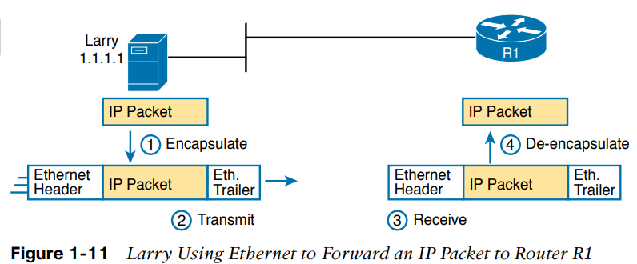

*Lưu ý*: Hình 1-11 minh hoạt Ethernet như một chuỗi các đoạn thẳng. Các hình minh họa mạng thường sử dụng quy chuẩn này khi vẽ Ethernet LAN, trong các trường hợp cáp LAN và thiết bị LAN không quan trọng, như trong trường hợp này. LAN sẽ có cáp và thiết bị, như là LAN switches, không được minh họa trong hình vẽ trên.

Hình 1-11 cho thấy 4 bước. Hai bước đầu xảy ra ở Larry, và hai bước sau xảy ra ở router R1, như sau:
Bước 1: Larry đóng gói IP packet giữa Ethernet header và Ethernet trailer, tạo thành một Ethernet *frame*
Bước 2: Larry truyền vật lý các bits của Ethernet frame, sử dụng dòng điện chạy qua cáp Ethernet
Bước 3: Router R1 nhận các tín hiệu điện thông qua cáp và tái tạo lại các bits bằng cách đọc các tín hiệu điện
Bước 4: Router R1 bóc tách IP packet khỏi Ethernet frame bằng cách loại bỏ Ethernet header và trailer

Khi quá trình này kết thúc, Larry và R1 đã thành công hoạt động với nhau để chuyển packet từ Larry tới Router R1.

*Lưu ý*: Các giao thức định nghĩa cả headers và trailers cho cùng một mục đích, nhưng headers tồn tại ở phần đầu của thông điệp và trailers tồn tại ở phần cuối

Tầng data-link và physical bao gồm một lượng lớn các giao thức và chuẩn. Ví dụ, tầng data link bao gồm các biến thể của giao thức Ethernet và các giao thức LAN không dây.

**Tóm lại, tầng TCP/IP data-link và physical bao gồm hai chức năng: các chức năng liên quan đến việc truyền dữ liệu vật lý, và các giao thức và quy tắc điều khiển các thiết bị vật lý**

### 2.7 Data Encapsulation
Như đã thấy khi giải thích cách HTTP, TCP, IP, và Ethernet hoạt động, khi gửi dữ liệu, mỗi tầng thêm header (và với giao thức data-link, thêm cả trailer) vào phần dữ liệu cung cấp bởi tầng cao hơn. **Thuật ngữ đóng gói (encapsulation) là quá trình cho headers (đôi lúc là trailers) xung quanh dữ liệu nào đó**

Nhiều ví dụ trong chương này minh họa quá trình đóng gói. Ví dụ web server Larry đóng gói nội dung của home page trong một HTTP header ở Hình 1-6. Tầng TCP đóng gói HTTP header và dữ liệu ở trong IP header ở Hình 1-10. Cuối cùng tầng Ethernet link đóng gói IP packets bên trong một header và trailer ở Hình 1-11.

Quá trình TCP/IP host gửi dữ liệu có thể được xem là một quá trình năm bước. Bốn bước đầu liên quan tới việc đóng gói thực thi bởi 4 tầng TCP/IP, và bước cuối là truyền dữ liệu vật lý của host. Thực tế, nếu bạn sử dụng mô hình TCP/IP năm lớp, mỗi bước tương ứng với vai trò của mỗi tầng. Các bước được tổng quát hóa như sau

Bước 1: Tạo và đóng gói dữ liệu ứng dụng với các header của tầng application. Ví dụ, thông điệp HTTP OK có thể được trả về ở HTTP header, theo sau bởi nội dung của trang web.

Bước 2: Đóng gói dữ liệu cung cấp bởi tầng application trong một header tầng transport. Đối với các ứng dụng người dùng cuối, header TCP hoặc UDP thường được sử dụng

Bước 3: Đóng gói dữ liệu cung cấp bởi tầng transport bên trong (IP) header tầng network. IP định nghĩa địa chỉ IP định danh các máy tính

Bước 4: Đóng gói dữ liệu cung cấp bởi tầng network bên trong header và trailer tầng data-link. Tầng này sử dụng cả header lẫn trailer

Bước 5: Truyền các bit. Tầng physical mã hóa tín hiệu lên thiết bị và truyền frame.

Các số ở Hình 1-12 tương ứng với năm bước trong các bước trên, đều minh họa cùng một khái niệm. LƯu ý rằng vì tầng application thường không cần thêm một header, hình minh họa không minh họa một header tầng application cụ thể, nhưng tầng application cũng đôi lúc cần header.

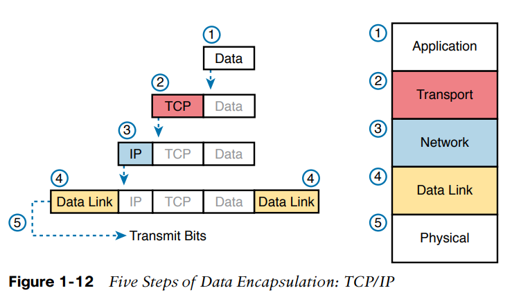

#### Tên của các thông điệp TCP/IP
Khi nói và viết về networking, mọi người thường sử dụng các thuật ngữ *segment, packet* và *frame* để nói tới các thông điệp trong Hình 1-13. Mỗi thuật ngữ có một ý nghĩa cụ thể, liên quan tới headers (và trailers) định nghĩa bởi một tầng và dữ liệu được đóng gói cùng với header.**Mỗi thuật ngữ nói về một layer: segment cho tầng transport, packet cho tầng network, và frame cho tầng data-link.**

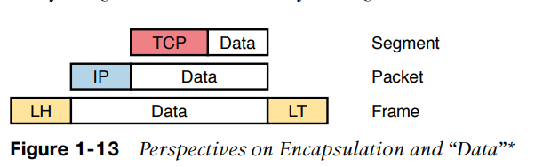

Hình 1-13 minh họa dữ liệu được đóng gói chỉ là "data". Khi tập trung vào một tầng cụ thể, các dữ liệu được đóng gói thường không quan trọng. Ví dụ IP packet có thể có một TCP header sau IP header, một HTTP header sau TCP header, và dữ liệu cho trang web sau HTTP header. Tuy nhiên khi nói về IP, bạn thường chỉ cần quan tâm về IP header, vì vậy mọi thứ sau IP header chỉ được gọi là data. Vì vậy, khi vẽ IP packets, mọi thứ sau IP header thường được minh họa chỉ là data.

## 3. Mô hình OSI và các thuật ngữ
Mặc dù bạn sẽ không bao giờ cần làm việc với một máy tính sử dụng OSI, để hiểu được các thuật ngữ networking hiện đại, bạn cần hiểu một vài thứ về OSI

### 3.1 So sánh tên và số tầng của OSI và TCP/IP

OSI tương tự với TCP/IP về mặt khái niệm. Nó có các tầng, và mỗi tầng định nghĩa một tập các chức năng mạng.

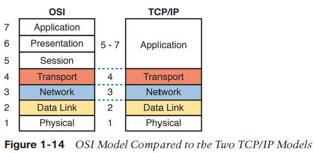

Lưu ý rằng mô hình TCP/IP được sử dụng ngày nay, ở bên phải, sử dụng y hệt tên tầng như OSI ở các tầng dưới. Các chức năng cũng thường giống, vì vậy khi bàn về networking và đọc tài liệu, bốn tầng cuối là tương đương nhau, về tên, về số và về ý nghĩa

Mặc dù thế giới sử dụng TCP/IP thay vì OSI, chúng ta thường sử dụng cách đánh số từ tầng OSI. VÍ dụ, khi nói tới giao thức tầng application trong mạng TCP/IP, thế giới vẫn nói tới protocol là "protocol tầng 7 (Layer 7 protocol)". Hơn nữa, mặc dù TCP/IP có nhiều chức năng hơn ở tầng application, OSI phân rã chúng thành session, presentation và applicattion. Phần lớn thời gian, không ai quan tâm về sự khác biệt, vì vậy chúng ta sẽ thấy "Layer 5-7 protocol" được sử dụng để nói về các giao thức ở tầng Application.

### 3.2 Thuật ngữ đóng gói dữ liệu OSI
Giống như TCP/IP, mỗi tầng OSI yêu cầu dịch vụ từ tầng dưới tiếp theo. Để cung cấp dịch vụ, mỗi tầng sử dụng header hoặc có thể là cả trailer. Tầng dưới đóng gói dữ liệu của tầng trên sau một header.

OSI sử dụng một thuật ngữ generic để nói tới các thông điệp thay vì frame, packet và segment mà TCP/IP dùng. OSI sử dụng thuật ngữ protocol data unit (PDU). Một PDU mô tả các bits chứa header và trailer cho tầng đó, cũng như là các dữ liệu được đóng gói. Ví dụ, một IP packet như trong Hình 1-13, sử dụng thuật ngữ OSI, là một PDU, cụ thể là mọt Layer 3 PDU (viết tắt là L3PDU) vì IP là một giao thức ở tầng 3. Layer x PDU (LxPDU) với x là số hiệu tầng đang nói tới như trong Hình 1-15

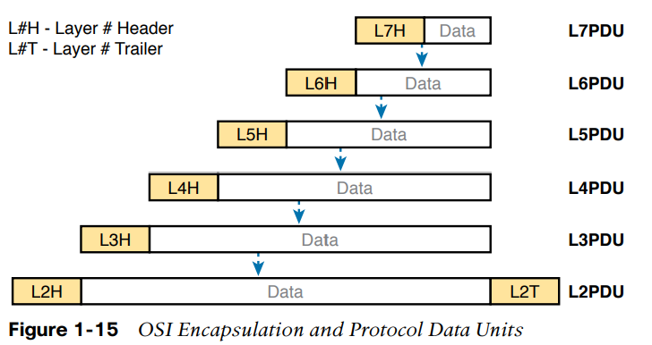

