# Các khái niệm Virtual LAN 

**Định nghĩa LAN:**

LAN bao gồm tất cả các thiết bị trong miền quảng bá (broadcast domain)

Miền quảng bá chứa tất cả các thiết bị kết nối tới LAN, khi một thiết bị bất kì gửi một frame quảng bá, tất cả các thiết bị còn lại nhận được frame đó. 

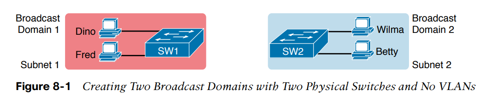

Với cài đặt mặc định, một switch coi tất cả các giao diện của nó ở trong cùng một miền quảng bá. Tức là, khi một frame quảng bá đi vào một cổng switch, nó sẽ chuyển tiếp frame tới tất cả các cổng còn lại. 

Với logic trên để tạo ra hai miền quảng bá LAN, bạn phải mua hai switch Ethernet LAN như trong Hình 8-1. 

**Bằng cách sử dụng VLANs**, một switch có thể xây hai Ethernet LAN - để tạo ra hai miền quảng bá.

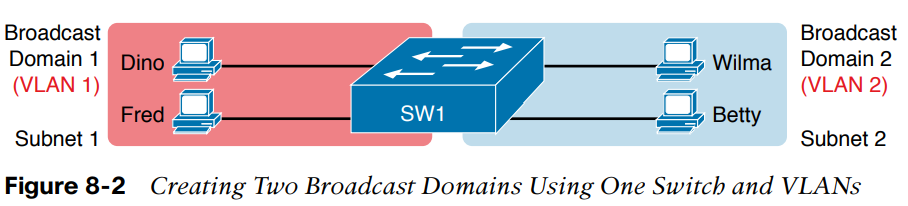

Ví dụ Hình 8-2, một switch duy nhất tạo ra hai VLANs, coi các cổng ở mỗi VLAN là độc lập. Switch sẽ không chuyển tiếp frame gửi bởi Dino (ở VLAN 1) tới Wilma hay Betty (ở VLAN2)

Một số lý do tạo miền quảng bá nhỏ hơn (VLANs):
- Giảm gánh nặng cho CPU trên mỗi thiết bị host, vì giảm số lượng thiết bị nhận frame quảng bá 
- Giảm nguy cơ bảo mật, vì số host nhận được frame từ switch giảm 
- Tăng bảo mật thông qua các chính sách bảo mật trong mỗi VLAN 
- Chia host thành các nhóm dễ quản lý

## 1. Tạo Multiswitch VLANs sử dụng Trunking 

Cấu hình VLANs trên một switch duy nhất thì dễ: chỉ cần gán số VLAN cho mỗi cổng. 

**Với nhiều switches bạn cần phải xét tới cách chuyển tiếp dữ liệu giữa các switches**

Khi sử dụng VLANs trong mạng có nhiều switch kết nối lẫn nhau, các switch cần sử dụng *VLAN trunking* trên các liên kết giữa các switch. VLAN trunking khiến các switch sử dụng một quá trình gọi là *VLAN tagging*, trong đó switch thêm một header vào frame trước khi gửi qua trunk. Phần header này chứa *VLAN identifier (VLAN ID)* để switch gửi có thể liên kết frame với một VLAN ID, và switch nhận có thể biết frame thuộc về VLAN nào. 

Xét hình dưới khi thiết kế VLAN không sử dụng trunking 

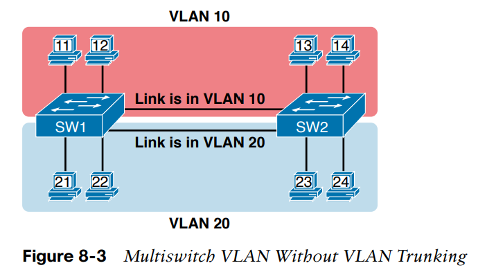

Thiết kê trên hoạt động, nhưng không scale tốt. Nó cần một liên kết vật lý giữa các switch để hỗ trợ mỗi VLAN. Nếu một thiết kế cần 10 hay 20 VLANs, thì phải có 10 hay 20 liên kết giữa các switch, và phải dùng 10 hay 20 cổng switch (trên mỗi switch) cho các liên kết đó. 

### 1.1 VLAN Tagging 

VLAN trunking tạo một liên kết giữa các switches và hỗ trợ bao nhiêu VLANs cũng được. Các switch coi liên kết trunk là một phần của tất cả VLANs, trunk giúp phân biệt giữa các VLAN, nhờ vào VLAN ID. 

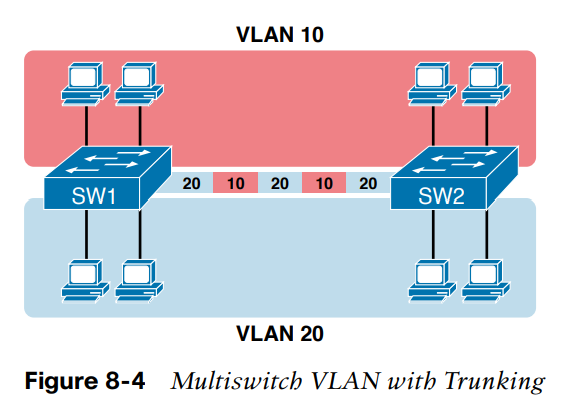

Quá trình chuyển frame vói VLAN trunk được mô tả trong hình dưới

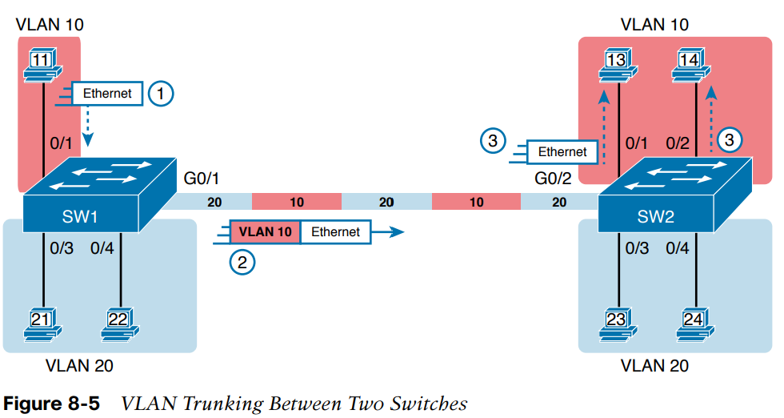

1. PC1 gửi frame quảng bá tới giao diện Fa0/1
2. Sau khi nhận được frame, SW1 thêm VLAN header vào Ethernet frame, với VLAN ID là 10 trước khi gửi 
3. Khi SW2 nhận được frame, đọc VLAN ID biết được frame ở trong VLAN 10. SW2 bỏ VLAN header, chuyển frame tới các cổng trong VLAN 10 

### 1.2 Giao thức trunking ISL và 802.1Q

Cisco hỗ trợ hai giao thức trunking
- Inter Switch Link (ISL) (Cisco tạo ra giờ không phổ biến)
- IEEE 802.1Q (phổ biến)

Trường 12-bit VLAN trong header 802.1Q hỗ trợ trên lý thuyết (2^12=4096) VLANs, nhưng thực tế chỉ 4094 (giá trị 0 và 4095 không được sử dụng)

Các switch cisco chia VLAN IDs (1-4094) thành hai khoảng: 
- khoảng bình thường (1-1005) tất cả switch đều sử dụng được 
- VLAN ID 1002-1005 không thể bị xóa và không được dùng access VLANs
- Mặc định tất cả các cổng được gán cho VLAN ID 1, VLAN ID 1 không thể bị xóa 
- khoảng mở rộng. (1006-4094) một số switch 

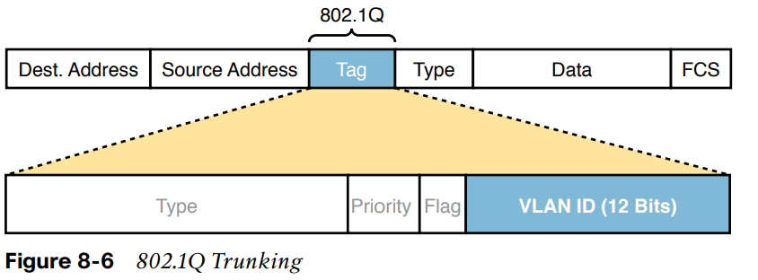

802.1Q định nghĩa một VLAN ID đặc biệt trên mỗi trunk là *native VLAN*. 802.1Q sẽ không thêm 802.1Q header vào frame trong native VLAN. Bất kì khi nào một switch nhận được một frame từ trunk mà không có 802.1Q nó biết frame đó là của native VLAN. 

Native VLAN cung cấp một số chức năng
- Switch cisco có thể kết nối cáp tới một switch không theo chuẩn trunking 802.1Q 

## 2. Chuyển dữ liệu giữa các VLANs

### 2.1 Định tuyến giữa các VLANs 


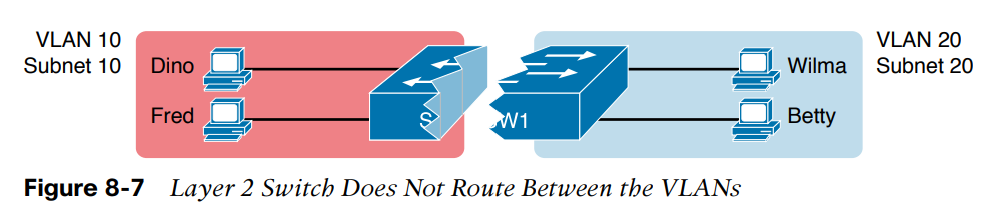

Switch Layer 2 không định tuyến giữa các VLANs. Ví dụ, khi Dino (ở VLAN 10) gửi Ethernet frame, nếu SW1 là một switch Layer 2, nó sẽ không chuyển tiếp frame tới các PCs bên phải ở VLAN 20 

### 2.2 Định tuyến packets giữa các VLANs với Router 

Các thiết bị trong một VLAN cần phải ở cùng subnet, các thiết bị ở khác VLAN phải ở khác subnet 

Để chuyển packet giữa các VLANs, cần dùng một hiết bị giống như router (Có thể dùng router, hoặc các switch có chức năng như router được gọi là Switch Layer 3).

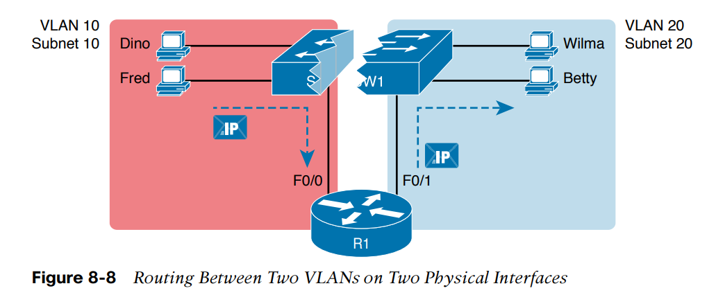

Một IP packet được định tuyến từ Fred, ở VLAN 10, tới Betty ở VLAN 20. Các Switch Layer 2 chuyển tiếp hai frame: một frame ở VLAN 10, từ Fred tới cổng F0/0 của R1, và một frame ở VLAN 20, từ cổng F0/1 của R1 tới Betty. 

Dưới góc nhìn Layer 3, Fred gửi IP packet tới router mặc định (R1), và R1 định tuyến packet ra khỏi cổng khác (F0/1) vào subnet có Betty. 


## 3. Cấu hình VLAN và VLAN Trunking

Nếu như muốn sử dụng VLAN thì cần phải cấu hình 

### 3.1 Tạo VLANs và gán truy cập VLANs vào một Giao diện 

Phải cấu hình switch sao cho 
- Switch có các giao diện truy cập (*access interface*)
- Các trunks hỗ trợ VLAN. 

#### Cấu hình VLAN mới 

Bước 1: Cấu hình VLAN mới 
  1. Từ chế độ cấu hình, sử dụng câu lệnh **vlan** *vlan-id* ở chế độ cấu hình toàn cục để tạo VLAN và di chuyển vào chế dộ cấu hình VLAN
  2. (Không bắt buộc) Sử dụng câu lệnh **name** *name* ở chế độ cấu hình VLAN để gán tên cho VLAN. Nếu không cấu hình, tên VLAN sẽ là VLANZZZZ, trong đó ZZZZ là VLAN ID
    
Bước 2: Với mỗi giao diện truy cập
  1. Sử dụng câu lệnh **interface** *type number* trong chế độ cấu hình toàn cục để di chuyển vào chế độ cấu hình giao diện cho mỗi giao diện 
  2. Sử dụng câu lệnh **switchport access vlan** *id-number* trong chế độ cấu hình giao diện để đặc tả VLAN liên kết với giao diện 
  3. (Không bắt buôc) Sử dụng câu lệnh **switchport mode access** trong chế độ cấu hình giao diện để làm cổng này luôn hoạt động ở chế độ truy cập (tức là không trunk) 

**Lưu ý**: Thuật ngữ *default VLAN* là VLAN mặc định mà mỗi cổng đều được gán. Đó là VLAN ID 1. 

### 3.2 Giao thức VLAN Trunking 

- Công nghệ proprietary của Cisco 
- Dùng để quảng bá cấu hình VLAN trên một switch, gọi là VTP server tới các switch khác trong cùng một VTP domain 
- Disable VTP 
```
vtp mode transparent 
vtp mode off
```
- Kiểm tra trạng thái VTP với câu lệnh 
```
show vtp status
```
- Nhiều doanh nghiệp không sử dụng VTP 

### 3.3 Cấu hình VLAN Trunking 
- Cấu hình hai cách
  1. Cấu hình thủ công 
  2. Cấu hình động

- Cấu hình các cài đặt
  1. Loại trunking: IEEE 802.1Q, ISL, hoặc động
  2. Chế độ administrative: Luôn trunk, luôn không trunk, hoặc động

#### Loại trunking 
Các switch hỗ trợ ISL và 802.1Q có thể trao đổi thông tin với nhau để quyết định sử dụng loại nào, thông qua giao thức Dynamic Trunking (DTP)
- Nếu cả hai switch đều hỗ trợ hai giao thức ISL sẽ được sử dụng
- Nếu không thì chúng sẽ sử dụng giao thức mà cả hai switch hỗ trợ. 
- Ngày nay nhiều Cisco switch không hỗ trợ giao thức ISL 

#### Chế độ trunking administrative 
- Chế độ trunking adminstrative là cài đặt cấu hình mong muốn sử dụng trunking hay không 
- Mỗi giao diện cũng có chế độ *operational*, là chế độ trunking đang được sử dụng trên giao diện 


Các tùy chọn chế độ trunking administrative với câu lệnh switchport mode 

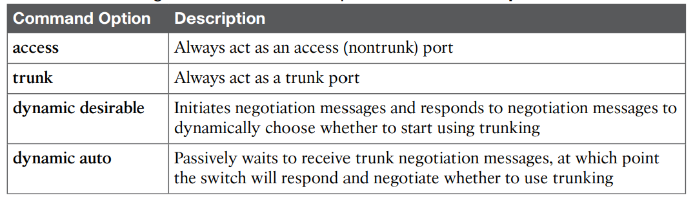

Bảng dưới mô tả chế độ trunking operational dựa trên chế độ adminstrative được cấu hình giữa hai switch 

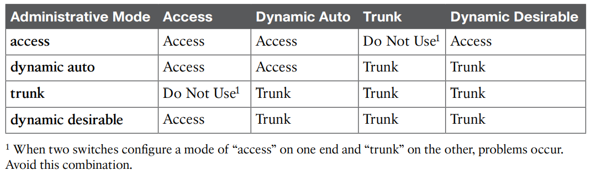

#### Best practice 
- Cisco khuyên nên tắt cấu hình trunk động trên phần lớn các cổng để tăng bảo mật, tránh lỗi do không lường trước  
- Sử dụng câu lệnh dưới để tắt DTP 
```
switchport nonegotiate 
```

### 3.4 Troubleshooting VLANs và VLAN trunking 
Về mặt tổng quát có thể làm theo các bước để tránh lỗi liên quan đến VLAN 

Bước 1: Xác thực rằng tất cả các VLANs đều đã được định nghĩa và đang hoạt động 
Bước 2: Đảm bảo VLANs muốn sử dụng phải ở trong danh sách VLANs được cho phép ở hai đầu trunk
Bước 3: Kiểm tra cấu hình trunk ở hai switch xem nếu một switch trunk switch còn lại không trunk 
Bước 4: Kiểm tra cài đặt VLAN ở cả hai đầu trunk đảm bảo cài đặt tương ứng với nhau 

#### Access VLANs Undefined hoặc Disabled 
- Switch không chuyển tiếp frame cho VLANs 
  1. Không biết bởi VLAN chưa được cấu hình hoặc học với VTP 
  2. Đã biết nhưng bị tắt (shut down) 

- VLAN có thể được định nghĩa bằng hai cách 
  1. Sử dụng câu lệnh cấu hình toàn cục **vlan** *number* 
  2. Hoc từ switch khác thông qua VTP 

- Kiểm tra trạng thái của VLAN sử dụng câu lệnh **show vlan**

- Để tắt hoặc bật VLAN sử dụng câu lệnh dưới ở chế độ VLAN

```
shutdown
no shutdown 
```

- Để tắt bật VLAN sử dụng câu lệnh dưới ở chế độ toàn cục 

```
no shutdown vlan [number]
shutdown vlan [number]
```
#### Trạng thái hoạt động trunking không khớp 
Các trường hợp trunk bị cấu hình sai 
  1. Cả hai switch không trunk 
  2. Một switch trunk và một switch không trunk 

Sử dụng câu lệnh dưới để kiểm tra chế độ Operational của cổng 
```
show interfaces [port-name] switchport 
```

Ví dụ 

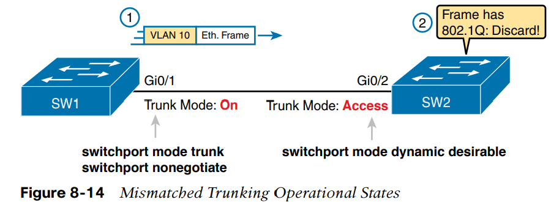

Switch 1 bật trunk sử dụng **switchport mode trunk**, tắt DTP sử dụng **switchport nonegotiate**

Switch 2 sử dụng **switchport mode dynamic desirable** phụ thuộc vào DTP. 

Ví Switch 1 tắt DTP, DTP của switch 2 thất bại => switch 2 chọn không trunk 


Vấn đề xảy ra khi gửi frame

Switch 1 gửi frame ở VLAN 10. Khi đến switch 2, switch hai thấy có header 802.1Q và coi đó là không hợp lệ, vì switch 2 coi cổng G0/2 là cổng access 

Câu lệnh tốt nhất để kiểm tra các thông tin liên quan tới trunk là 
```
show interfaces trunk 
show interfaces switchport 
```

#### Danh sách VLANs hỗ trợ trên Trunks 

- VLAN trunk có thể không chuyển tiếp frame cho một VLAN được định nghĩa và đang hoạt động vì một lý do nào đó 

Để kiểm tra thông tin về các VLANs mà trunk hỗ trợ sử dụng 
```
show interfaces trunk 
```

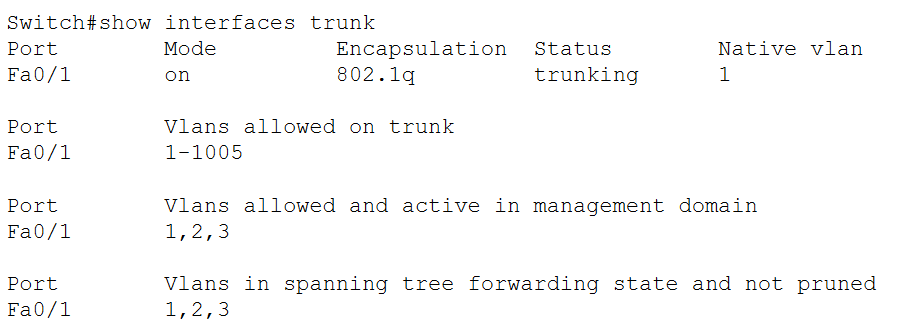

Các VLANs ở trong danh sách cho phép và đang hoạt động phải có tiêu chí sau
1. VLAN không bị xóa khỏi danh sách *allowed* trên trunk bằng câu lệnh **switchport trunk allowed vlan**
2. VLAN tồn tại và đang hoạt động 
3. VLAN không bị VTP-pruned khỏi trunk. Trunk ở trạng thái chuyển tiếp STP trong VLAN đó 

