# 1. IP
- Địa chỉ IP dùng để định danh host trong mạng 

- Địa chỉ IPv4 gồm 32 bit 

# 2. Mạng Classful IPv4 

## 2.1 Lớp mạng IPv4 

<div align="center">
<table>
	<tr>
		<th>
			Class
		</th>
		<th>
			Giá trị octet đầu
		</th>
		<th>
			Mục đích
		</th>
	</tr>
	<tr>
		<td>
			A
		</td>
		<td>
			1-126
		</td>
		<td>
			Unicast (mạng lớn)
		</td>
	</tr>
		<tr>
		<td>
			B
		</td>
		<td>
			127-191
		</td>
		<td>
			Unicast (mạng vừa)
		</td>
	</tr>
		<tr>
		<td>
			C
		</td>
		<td>
			192-223
		</td>
		<td>
			Unicast (mạng nhỏ)
		</td>
	</tr>
		<tr>
		<td>
			D
		</td>
		<td>
			224-239
		</td>
		<td>
			Multicast
		</td>
	</tr>
		<tr>
		<td>
			E
		</td>
		<td>
			240-255
		</td>
		<td>
			Dùng cho mục đích thử nghiệm
		</td>
	</tr>
</table>
</div>

Tất cả các địa chỉ bắt đầu bằng 0 và bằng 127 không được sử dụng. 

<div align="center">
<table>
	<tr>
		<th>
		</th>
		<th>
			Class A
		</th>
		<th>
			Class B
		</th>
		<th>
			Class C
		</th>
	</tr>
	<tr>
		<td>
			Giá trị octet đầu
		</td>
		<td>
			1-126
		</td>
		<td>
			128-191
		</td>
		<td>
			192-223
		</td>
	</tr>
	<tr>
		<td>
			Các bit đầu
		</td>
		<td>
			0
		</td>
		<td>
			10
		</td>
		<td>
			110
		</td>
	</tr>
	<tr>
		<td>
			Số network hợp lệ
		</td>
		<td>
			1.0.0.0-126.0.0.0
		</td>
		<td>
			128.0.0.0-191.255.0.0
		</td>
		<td>
			192.0.0.0-223.255.255.0
		</td>
	</tr>
	<tr>
		<td>
			Số network
		</td>
		<td>
		2<sup>7</sup>-2 = 126
		</td>
		<td>
			2<sup>14</sup>-2 = 16,384
		</td>
		<td>
			2<sup>21</sup>-2 = 2,097,152
		</td>
	</tr>
	<tr>
		<td>
			Số host trên mỗi network
		</td>
		<td>
			2<sup>24</sup>-2
		</td>
		<td>
			2<sup>16</sup>-2
		</td>
		<td>
			2<sup>8</sup>-2
		</td>
	</tr>
	<tr>
		<td>
			Số octet (bits) ở phần mạng
		</td>
		<td>
			1 (8)
		</td>
		<td>
			2 (16)
		</td>
		<td>
			3 (24)
		</td>
	</tr>
	<tr>
		<td>
			Số octet (bits) ở phần host
		</td>
		<td>
			3 (24)
		</td>
		<td>
			2 (16)
		</td>
		<td>
			1 (8)
		</td>
	</tr>
	<tr>
		<td>
			Mặt nạ mặc định
		</td>
		<td>
			255.0.0.0
		</td>
		<td>
			255.255.0.0
		</td>
		<td>
			255.255.255.0
		</td>
	</tr>
</table>
</div>

### Số mạng của mạng Class A, Class B, Class C 

<div align="center">
	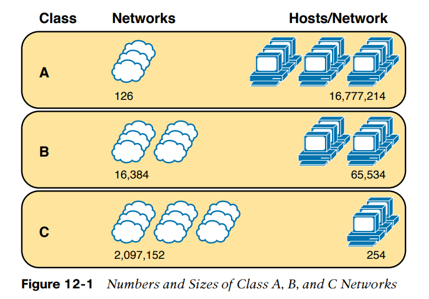
</div>

### Định dạng địa chỉ 
Địa chỉ được chia thành hai phần 
- Phần mạng 
- Phần host 

Khi so sánh hai địa chỉ IP bất kì ta có 
- Các địa chỉ ở cùng mạng sẽ có cùng giá trị ở phần mạng 
- Các địa chỉ ở cùng mạng sẽ có khác giá trị ở phần host

<div align="center">
	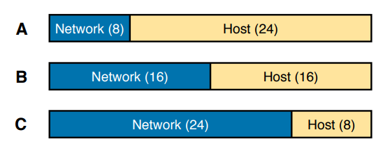
</div>

Ví dụ: 
Địa chỉ IP 10.1.1.1 và 10.1.1.2 có cùng giá trị (10) ở phần mạng, nhưng khác giá trị ở phần host

### Mặt nạ mặc định 
Mặc dù con người có thể hiểu được khái niệm ở hình trên, máy tính thì không. Để truyền đạt được khái niệm trên đến máy tính, mỗi network class có một mật nạ mặc định định nghĩa <strong>kích cỡ</strong> của các phần <strong>mạng</strong> và <strong>host</strong>.

Ví dụ: 
Mạng class A 10.0.0.0 có octet đầu tiên (8 bit) cho phần mạng, và 3 octet còn lại (24 bit) cho phần host. Nên mặt nạ mặc định của Class A là 255.0.0.0 

<div align="center">
	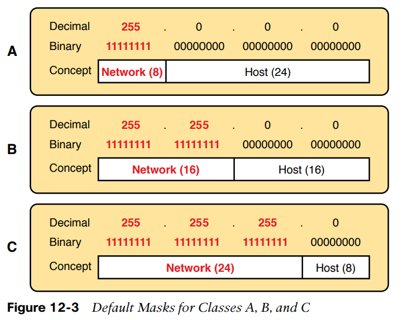
</div>

### Số host trên mỗi mạng 
Số host trên mỗi mạng có thể được tính bằng công thức 
$2^H-2$
Trong đó $H$ là số bit cho phần host 

-2 bởi vì mỗi mạng giữ lại hai địa chỉ dùng cho mục đích đặc biệt 
- Địa chỉ network ID
- Địa chỉ network broadcast 

### Suy ra Network ID và các số liên quan 
Mỗi classful network có 4 số chính mô tả network đó. Bạn có thể suy ra 4 số này với địa chỉ IP bất kì trong mạng. Các số này là 
- Network id 
- Địa chỉ dùng được đầu tiên (thấp nhất)
- Địa chỉ dùng được cuối cùng (cao nhất)
- Địa chỉ quảng bá network 

Quá trình xác định 4 giá trị trên khi có một địa chỉ IP bất kì 
Bước 1: Xác định class (A, B, hoặc C) dựa trên octet đầu tiên 
Bước 2: Chia phần mạng và phần host dựa trên class 
Bước 3: Để tìm network number, thay phần host bằng 0 
Bước 4: Để tìm địa chỉ đầu tiên, thêm 1 vào octet thứ 4 của network ID 
Bước 5: Để tìm địa chỉ broadcast, thay đổi các octets của phần host thành 255 
Bước 6: Để tìm địa chỉ cuối, trừ 1 khỏi octet thứ 4 của địa chỉ broadcast 

<div align="center">
	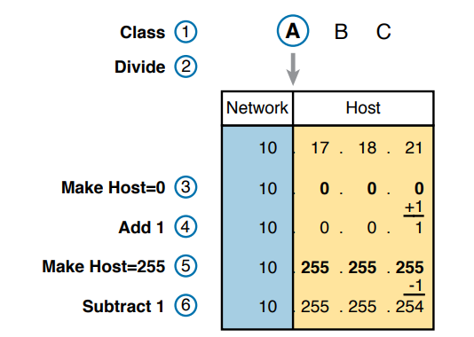
</div>

### Network ID và địa chỉ Network Broadcast đặc biệt 
- Đối với Class A, giá trị của octet đầu tiên bỏ qua giá trị 0 và 127.
  - Địa chỉ 0.0.0.0 được dùng cho mục đích broadcast, nên tất cả các địa chỉ mà có octet đầu là 0 được giữ lại. 
  - Địa chỉ 127.0.0.0 được giữ lại vì một địa chỉ đặc biệt dùng cho kiểm thử, gọi là địa chỉ loopback (127.0.0.1)

# 3. Phân tích subnet mask 

## 3.1 Các định dạng mặt nạ subnet 
### Số nhị phân 32 bit
- Không được đan xen 1 và 0 
- 1 ở bên trái cùng 
- 0 ở bên phải cùng 
Ví dụ 
```
11111111 11111111 11000000 00000000
11111111 11111000 00000000 00000000
```
### Mặt nạ prefix 
```
/24 
/18
/12
```
### Mặt nạ DDN 
```
255.255.255.240 
255.255.192.0 
```

### Chuyển đổi giữa các mặt nạ 
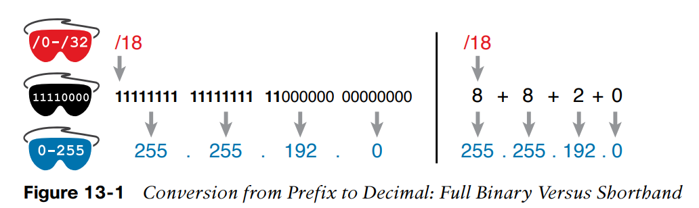
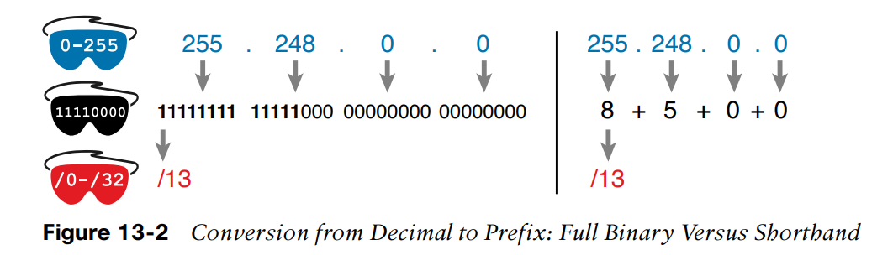


## 3.2 Mặt nạ chia địa chỉ subnet làm hai phần 
Mặt nạ mạng chia địa chỉ subnet làm hai phần 
1. Phần *prefix* hay *subnet*: Giống nhau với tất cả địa chỉ trong cùng subnet
2. Phần *host*: Khác nhau với tất cả địa chỉ trong cùng subnet 

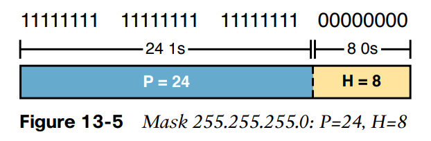

## 3.3 Mặt nạ và Class chia các địa chỉ làm ba phần 
Ba phần 
1. Phần *network* 
2. Phần *subnet*
3. Phần *host* 

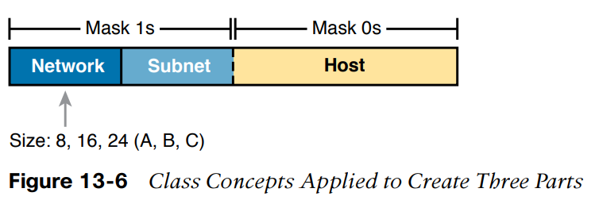

## 3.4 Địa chỉ Classless và Classful 
Hai thuật ngữ *classless* và *classful* là hai cách để nghĩ về địa chỉ Ipv4. 

- *classful* có nghĩa là phần prefix được tách thành phần network và subnet 
- *classless* có nghĩa là không quan tâm tới Class A, B hay C và coi phần prefix là một chỉ có subnet. 

*Lưu ý*: Thuật ngữ *classless* và *classful* khi được dùng trong context khác có ý nghĩa khác, như là các giao thức định tuyến có thể được chia thành *classless* hay *classful*,... Khi thấy thuật ngữ *classless* và *classful* cần để ý context: địa chỉ, định tuyến hay giao thức định tuyến 

## 3.5 Tính toán dựa trên định dạng địa chỉ IPv4 

- Biết số bit cho host => Tính được số địa chỉ IP host trong subnet **2<sup>H</sup> - 2**, H là số bit host
- Biết số bit trong subnet và mạng chỉ dùng một mặt nạ => Tính được số subnet trong network **2<sup>S</sup>**, S là số subnet. 
  
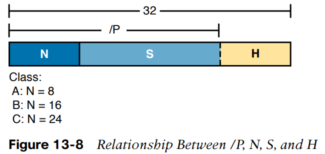

Ví dụ: Tính số host và subnet của mạng mà địa chỉ IP và mặt nạ này thuộc về 

```
IP address 8.1.4.5
Mask 255.255.0.0
```

Bước 1. 255.255.0.0 = /16 => P = 16 
Bước 2. 8.1.4.5 có octet đầu là 8 ở trong khoảng 1-126, nên địa chỉ thuộc Class A; => N = 8 
Bước 3. S = P - N = 16 - 8 = 8 
Bước 4. H = 32 - P = 32 - 16 = 16 
Bước 5. Số host = 2<sup>16</sup> - 2 = 65,534 
Bước 6. Số subnets = 2<sup>8</sup> = 256 

# 4. Subnetting 
## 4.1 Giới thiệu về subnetting 
- Bắt đầu với một mạng lớn, phân chia thành nhiều mạng nhỏ (gọi là subnet) để quản lý 

### Ví dụ cơ bản 
- Mạng lớp A, B, C chỉ là một tập các địa chỉ IP tuân theo một quy tắc nào đó. 

Ví dụ, mạng B 172.16.0.0 bao gồm tất cả địa chỉ IP bắt đầu với 172.16: 127.16.0.0, 172.16.0.1, 172.16.0.2,... tới 172.16.255.255. 

IP subnet (subdivided network) đơn giản là tập con của mạng A, B hoặc C. 
Ví dụ, một subnet của mạng Class B có thể bao gồm tất cả các địa chỉ bắt đầu với 172.16.1: 172.16.1.0, 172.16.1.1, 172.16.1.2,... tới 172.16.1.255. Một subnet cũng của mạng Class B đó có thể là tất cả các địa chỉ bắt đầu với 172.16.2. 

<div align="center">
	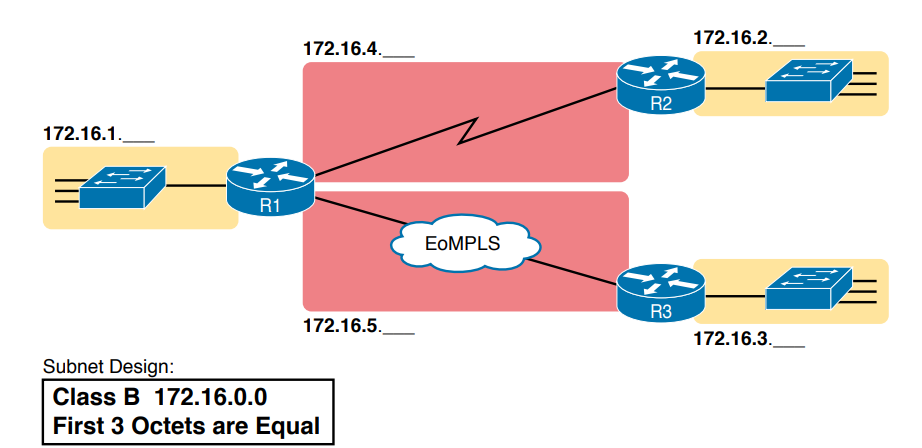
</div>

## 4.2 Định nghĩa một subnet 
IP subnet là một tập con của một mạng classful, các quy luật cho subnet 
- Subnet chứa tập các số liên tiếp 
- Subnet chứa 2<sup>H</sup> số, trong đó H là số bit host định nghĩa bởi subnet mask 
- Hai số đặc biệt không được dùng làm địa chỉ IP 
  - Số đầu tiên (nhỏ nhất) dùng làm định danh cho subnet (Subnet ID)
  - Số cuối cùng (lớn nhất) là địa chỉ quảng bá subnet
- Các địa chỉ còn lại, có giá trị ở giữa subnet ID và địa chỉ quảng bá subnet, được dùng làm địa chỉ IP unicast 

### Ví dụ 

```
Địa chỉ IP 172.16.150.41
Mặt nạ 255.255.192.0
```

Phân tích ta có 
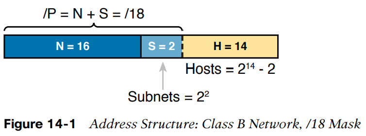

Mạng lớp B sẽ có 4 subnets cùng kích cỡ. Hình 14-2 minh họa mạng lớp B trên 

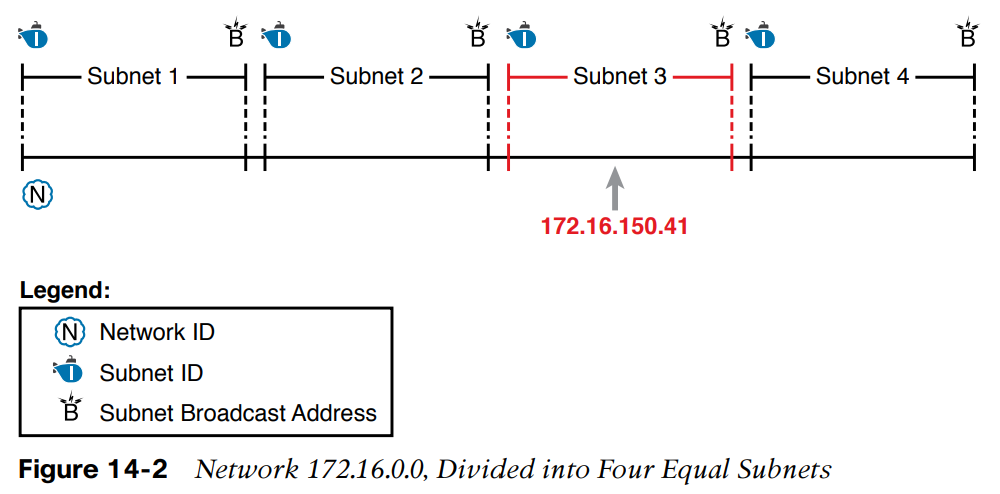

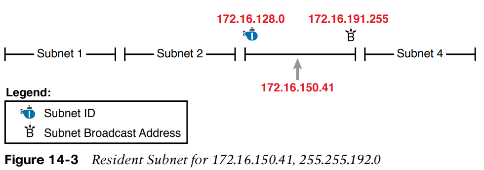

## 4.3 Các khái niệm về Subnet ID 

- Một số dùng để mô tả một subnet 
- Khi biết được subnet mask, subnet ID định danh subnet và có thể dùng để biết được địa chỉ quảng bá subnet và khoảng các địa chỉ trong subnet **Chỉ cần subnet ID và mask là mô tả đầy đủ subnet**

Bảng dưới mô tả một vài thông tin về Subnet ID 

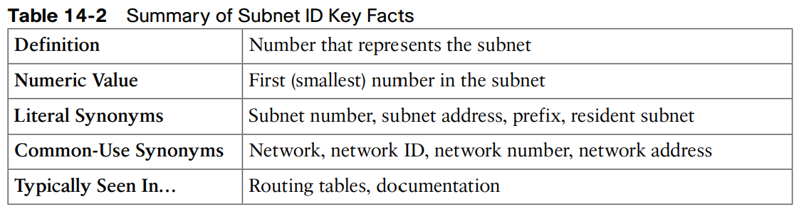

## 4.4 Các khái niệm về địa chỉ quảng bá Subnet (Subnet Broadcast Address)

Bảng dưới mô tả một vài thông tin về Subnet Broadcast Address 
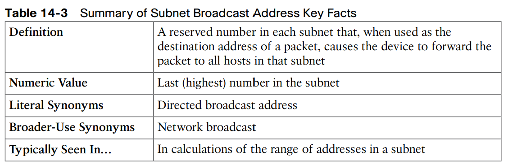