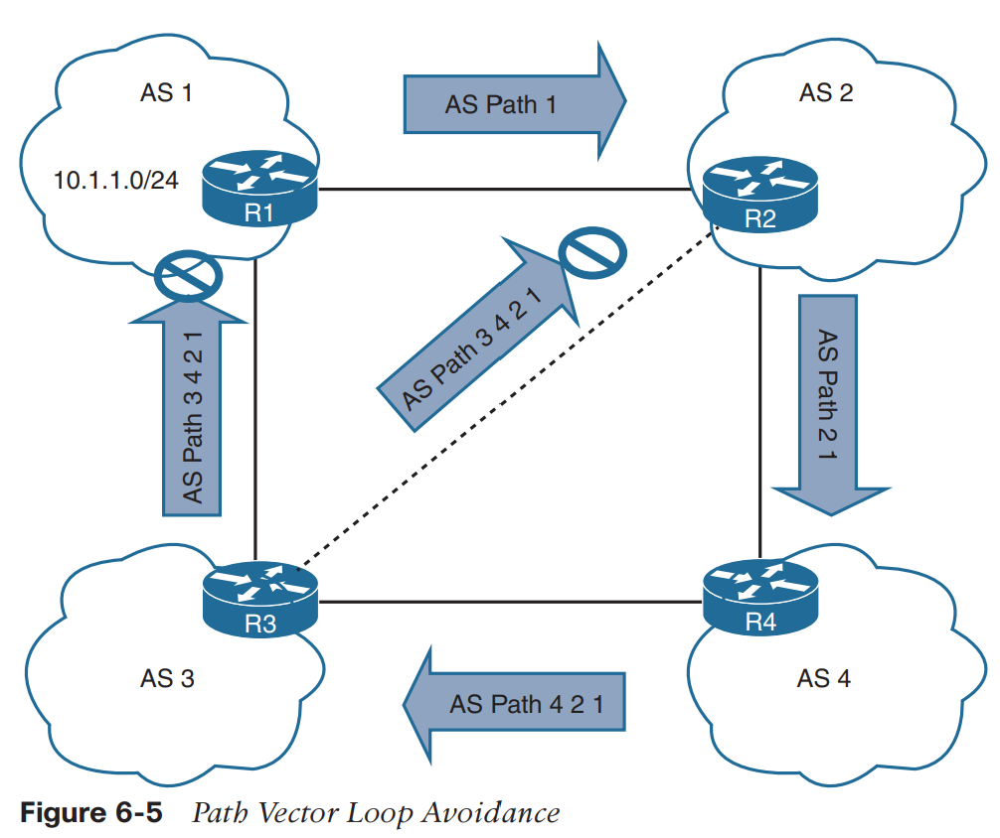

# Định tuyến 

## 1. Cơ bản 
- Chức năng chính của router là **chuyển IP packet từ một network này sang một network khác**. 
- Router **học đường đi** các network không được kết nối trực tiếp thông qua cấu hình định tuyến tĩnh hoặc thông qua các giao thức định tuyến động. 

## 2. Định tuyến động 
- Các giao thức định tuyến IP động **phân tán thông tin** về topology mạng giữa các routers và **cập nhật** tự động khi có thay đổi topology. 
- Với giao thức định tuyến động, routers sẽ cố chọn đường đi không lặp tốt nhất để chuyển tiếp packet tới địa chỉ IP đích 
- Một mạng gồm các routers kết nối với nhau và các hệ thống có liên quan được quản lý bởi một admin chung được gọi là một *autonomous system (AS)* hay một *routing domain*. Internet gồm hàng nghìn các autonomous system trải dài trên trái đất. 

### Các loại giao thức định tuyến động 
Có thể chia ra làm hai loại 

1. Các giao thức Interior Gateway (IGPs): Định tuyến bên trong một autonomous system 
2. Các giao thức Exterior Gateway (EGPs): Định tuyến giữa các autonomous systems. 

Bảng dưới là các giao thức phổ biến 

|Giao thức|Loại|
|---------|----|
|Routing Information Protocol Verson 2 (RIPv2)|IGP|
|Enhanced Interior Gateway Routing (EIGRP)|IGP|
|Open Shortest Path First (OSPF)|IGP|
|Intermediate System-to-Intermediate System (IS-IS)|IGP|
|Border Gateway Protocol (BGP)|EGP|

*Lưu ý*: Mặc dù BGP là một giao thức EGP nhưng nó có thể được dùng bên trong autonomous system. Nếu nó trao đổi tuyến trong một autonomous system, nó được gọi là *interior BGP (iBGP) session*, ngược lại nếu nó trao đổi tuyến giữa các hệ autonomous, nó được gọi là *exterior BGP (eBGP) session.* 


### Thuật toán distance vector 
- Giao thức định tuyến distance vector, như là RIP sử dụng hai khái niệm
  1. Distance: Là thước đo tuyến để tới network, ở đây cụ thể là số lần nhảy (hop-count) 
  2. Vector: Là giao diện hoặc hướng để tới network 

Khi môt router nhận thông tin định tuyến từ hàng xóm nó lưu thông tin đó trong bảng định tuyến, và thuật toán distance vector (như là *Bellman-Ford và Ford-Fulkerson*) được dùng để quyết định **đường nào là đường không có lặp tốt nhất để tới đích**. Khi tìm được đường tốt nhất, thông tin về nó sẽ được nạp vào bảng định tuyến và được quảng bá cho các router hàng xóm.  


R3->R1->R7

### Thuật toán distance vector enhanced (cải tiến) 

- EIGRP sử dụng thuật toán diffusing update (DUAL) để tính đường đi ngắn nhất tới đích trong mạng 
- EIGRP quảng bá thông tin mạng tới các hàng xóm giống như các giao thức distance vectors khác
- EIGRP được gọi là giao thức định tuyến *hybrid* vì nó có đặc tính của các giao thức distance vector và link-state

Các cải tiến của EIGRP so với RIP 
- Thời gian hội tụ nhanh khi mạng thay đổi
- Gửi cập nhật chỉ khi có thay đổi trong mạng. Không gửi toàn bộ cập nhật bảng định tuyến theo định kỳ (các giao thức distance vector)
- Sử dụng *hellos* để hình thành quan hệ với hàng xóm giống như các giao thức **link-state**
- Sử dụng bandwidth, delay, reliability, load và maximum transmission unit (MTU) thay vì hop count để tìm đường đi 
  


R3->R1->R2->R7

### Thuật toán Link-State

- Giao thức định tuyến động link-state quảng bá link state và link metric cho mỗi link được kết nối và các router được kết nối trực tiếp tới mỗi router trong mạng 
- OSPF và IS-IS là hai giao thức định tuyến link-state thường được sử dụng 
- Quảng bá của OSPF được gọi là link-state advertisements (LSAs)
- IS-IS sử dụng link-state packets (LSPs) để quảng bá 

- Khi router nhận thông tin quảng bá từ hàng xóm, nó lưu thông tin trong cơ sở dữ liệu cục bộ gọi là *link-state database (LSDB)* và quảng bá thông tin link-state tới các router hàng xóm. 
- Thông tin link-state sẽ được *ngập* qua mạng, không thay đổi, từ router sang router. => **Cho phép các routers trong mạng có một bản đồ mạng như nhau**

- Sử dụng bản đồ mạng, mỗi router sẽ sử dụng thuật toán Dijkstra để tính đường đi ngắn nhất không có lặp, sau đó thuật toán link-state sẽ nạp các bảng định tuyến với thông tin trên. 
- Các giao thúc link-state thường yêu cầu nhiều CPU và bộ nhớ hơn các giao thức distance vector
- Ít dính vào lặp, và thường đưa ra các đường tốt hơn 


### Thuật toán Path Vector 
- Giao thức path vector như BGP giống với giao thức distance vector
- Thay vì sử dụng *hop-count*, BGP **sử dụng các thuộc tính đường đi khác** bao gồm *autonomous system path (AS_Path)*, *multi-exit discriminator (MED)*, *origin*, *next hop*, *local preference*, *atomic aggregate*. 
- **Giao thức path vector đảm bảo đường đi không có lặp** bằng cách lưu lại bản ghi của mỗi autonomous system mà routing advertisement đi qua. Mỗi khi router nhận được một advertisment nếu as là một phần của AS_Path thì advertisment đó sẽ bị loại bỏ. 

Hình 6-5 minh họa cách phòng tránh lặp 

1. R1 (AS 1) thông báo mạng 10.1.1.0/24 cho R2 (AS 2). R1 thêm AS 1 vào AS_Path trong quá trình thông báo cho R2 
2. R2 thông báo 10.1.1.0/24 cho R4 và thêm AS 2 vào AS_Path trong quá trình thông báo cho R4
3. R4 thông báo mạng 10.1.1.0/24 cho R3 và thêm AS 4 vào AS_PATH trong quá trình thông báo cho R3 
4. R3 thông báo mạng 10.1.1.0/24 cho R1 và R2 sau khi thêm AS 3 vào AS_Path trong quá trình thông báo 
5. Khi R1 nhận thông báo mạng 10.1.1.0/24 từ R3, nó hủy thông báo vì R1 thấy AS 1 ở trong AS_Path. Tương tự R2 cũng hủy thông báo 10.1.1.0/24 từ R3 vì có AS 2 ở trong AS_PATH.



### Path Selection 
- Router chọn đường đi cho packet bằng cách xét prefix length trong Forwading Information Base (FIB), FIB có thông tin từ Routing Information Base (RIB)
- RIB gồm các tuyến có được từ các giao thức định tuyến 

Việc chọn đường đi có ba thành phần chính 

1. Prefix length: Độ dài của số bit 1 trong subnet mask (độ dài phần Prefix)
2. Adminstrative distance: Độ tin cậy của nguồn thông tin định tuyến. Nếu một router học tuyến từ hơn một giao thức định tuyến, và tất cả các tuyến đều có cùng prefix length, thì AD sẽ được so sánh 
3. Metrics: Là một đơn vị được một giao thức định tuyến sử dụng làm thang đó để tìm đường đi tốt nhất. Các metrics sẽ khác nhau tùy thuộc vào giao thức

#### Prefix length 
Giả dụ router có các routes với các prefix length khác nhau trong bảng định tuyến 

- 10.0.3.0/28
- 10.0.3.0/26
- 10.0.3.0/24 

Bảng 6-2 mô tả bảng định tuyến trên 


Nếu một packet cần được chuyển tiếp, tuyến được chọn sẽ là tuyến có prefix length dài nhất. Ví dụ, /28 được ưu tiên so với /26

Ví dụ một packet cần được chuyển tiếp đến 10.0.3.14, router sẽ tìm được 3 routes có dải địa chỉ phù hợp. Packet sẽ được chuyển cho 10.1.1.1 với cổng ra là Gigabit Ethernet 1/1 vì nó có prefix length dài nhất 

Tương tự nếu một packet cần chuyển tiếp tới 10.0.3.42, router tìm được 2 routes có dải địa chỉ phù hợp 10.0.3.0/24 và 10.0.3.0/26. Packet sẽ được chuyển cho 10.2.2.2 vì 10.0.3.0/26 có độ dài prefix dài nhất. 

#### Administrative Distance 

Bảng dưới cung cấp giá trị ADs mặc định cho các giao thức định tuyến khác nhau 


RIB lấy tuyến từ nhiều tiến trình giao thức định tuyến. Mỗi giao thức định tuyến đều cung cấp cùng thông tin cho RIB: mạng đích, địa chỉ IP next-hop, AD, và giá trị metrics. RIB chấp nhận hay không chấp nhận tuyến dựa trên logic: 
- Nếu tuyến không tồn tại trong RIB, tuyến được chấp nhận 
- Nếu tuyến tồn tại trong RIB, phải so sánh AD.
  - Nếu AD tuyến trong RIB nhỏ hơn tuyến mới, tuyến mới bị hủy và thông báo cho tiến trình định tuyến 
  - Nếu AD tuyến trong RIB lớn hơn tuyến mới, tuyến mới được chấp nhận, và thông báo giao thức của tuyến cũ 

Ví dụ 

Một router có OSPF, IS-IS, và EIGRP, và cả ba giao thưucs đều học được đích 10.3.3.0/24 với các đường đi và metric khác nhau. Cả ba giao thức đều muốn nạp tuyến tới 10.3.3.0/24 vào bảng định tuyến. Vì prefix length là như nhau, nên phải sử dụng AD, giao thức mà có AD thấp nhất sẽ có tuyến được nạp vào. => Tuyến của EIGRP 


Các giao thức không được nạp tuyến vào bảng sẽ giữ lại tuyến để nếu tuyến hiện tại thất bại, các giao thức đó có thể nạp tuyến của chúng (lại lựa chọn dựa trên AD)

#### Metrics 
##### Equal-Cost Multipathing 

- Nếu giao thức định tuyến hỗ trợ và tìm được nhiều đường đi tốt nhất, router sẽ nạp tất cả các tuyến tìm được (nếu có thể vì có giới hạn tuyến tối đa cho mỗi đích). Đó chính là *equal-cost-multipathing (ECMP)*.
- RIP, EIGRP, OSPF, IS-IS đều hỗ trợ ECMP
- ECMP cung cấp cơ chế tăng băng thông qua nhiều đường bằng cách phân chia trafic bằng nhau qua các links 


##### Unequal-Cost Load Balancing 

- Mặc định các giao thức định tuyến chỉ nạp tuyến với metric thấp nhất 
- EIGRP có thể được cấu hình để nạp nhiều tuyến với các path metrics khác nhau => Cho phép cân bằng tải unequal-cost qua nhiều tuyến. 

Hình 6-7 minh họa topology với 4 routers chạy EIGRP. Đường đi R1 tới R3 thông qua R1-R2-R3 được gán path metric 3328, và đường đi R1-R4-R3 có path metric 5632 


R1 chuyển 71 packet cho R2 với mỗi 120 packet chuyển cho R4 

## 2. Định tuyến tĩnh 
- Cung cấp kiểm soát chính xác định tuyến 
- Gánh nặng để quản trị khi số router và network tăng 
- Không yêu cầu băng thông 
- Không có sự giao tiếp giữa các routers, khi một liên kết bị hỏng, các routers khác sẽ không biết được đường đi qua liên kết đó không hợp lệ 

Hữu dụng khi 
- Không sử dụng giao thức định tuyến động được vì router bị giới hạn về CPU hay bộ nhớ
- Các tuyến học từ giao thức định tuyến động cần được thay thế

Các loại tuyến tĩnh 
1. Tuyến tĩnh gắn trực tiếp
2. Tuyến tĩnh đệ quy 
3. Tuyến tĩnh đặc tả đầy đủ 

### 2.1 Tuyến tĩnh gắn trực tiếp (Directly Attached Static Routes)
- Static route chỉ sử dụng giao diện outbound next-hop được gọi là tuyến tĩnh gắn trực tiếp 
- Yêu cầu trạng thái của giao diện outbound up để tuyến có thể được nạp vào RIB 
- Cấu hình với câu lệnh

```
ip route network subnet-mask next-hop-id
```


Hình 6-8 minh họa R1 kết nối với R2 sử dụng kết nối serial. R1 sử dụng tuyến tĩnh gắn trực tiếp tới mạng 10.22.22.0/24, và R2 sử dụng tuyến tĩnh gắn trực tiếp tới mạng 10.11.11.0/24 để cho phép kết nối giữa hai mạng. Tuyến tĩnh cần thiết trên cả hai routers để traffic có đường quay lại. 

*Lưu ý*: Cấu hình tuyến tĩnh gắn trực tiếp tới một giao diện sử dụng ARP có thể gây ra vấn đề liên quan đến hiệu năng. Router phải lặp lại quá trình ARP cho mỗi địa chỉ đích mà match với static route. 

### 2.2 Tuyến tĩnh đệ quy (Recursive Static Routes)
- Tuyến tĩnh đệ quy đặc tả địa chỉ IP của địa chỉ next-hop không đặc tả giao diện outbound. 
- Cho phép giữ lại tuyến nếu liên kết hỏng
- Cấu hình với câu lệnh
```
ip route network subnet-mask next-hop-id
```

Ví dụ


R1 và R2 kết nối sử dụng cổng Gi0/0. R1 có recursive static route tới mạng 10.22.22.0/24, R2 cũng có recursive static route tới 10.11.11.0/24

R1 sẽ cấu hình bằng 
```
ip route 10.22.22.0 255.255.255.0 10.12.1.2
```

R2 sẽ cấu hình bằng 
```
ip route 10.11.11.0 255.255.255.0 10.12.1.1
```

Khi có packet với địa chỉ ip đích nằm trong mạng 10.22.22.0/24, R1 sẽ nhìn vào RIB và thấy địa chỉ IP next-hop là 10.12.1.2, R1 tiếp tục nhìn vào bảng RIB để tìm tuyến tới 10.12.1.2, và cứ tiếp tục một cách đệ quy cho tới khi tìm được giao diện để chuyển tiếp packet (quá trình look-up). 

### 2.3 Tuyến tĩnh đặc tả đầy đủ (Fully Specified Static Routes)

- Quá trình lookup của tuyến tĩnh đệ quy có thể gây lỗi khi cho ra cổng trỏ ngược tới đích. Điều này sẽ gây ra định tuyến không tối ưu và một số vấn đề khác.
- Vấn đề trên được giải quyết bằng cách cấu hình tuyến tĩnh bằng cả **outbound interface và next-hop IP address**. Đó chính là **tuyến tĩnh đặc tả đầy đủ**.
- Đặc tả next-hop address cùng với outbound interface sẽ loại bỏ *lookup* và các vấn đề liên quan tới *ARP* khi chỉ sử dụng outbound interface. 
- Cấu hình bằng câu lệnh 

```
ip route network subnet-mask outbound-interface next-hop-id
```
### 2.4 Floating Static Routing 
- Giá trị AD mặc định cho tuyến tĩnh là 1 
- Có thể cấu hình tuyến tĩnh với giá trị AD từ 1 tới 255 cho một tuyến cụ thể
- Sử dụng floating static route là kĩ thuật phổ thông cung cấp kết nối dự phòng cho các tuyến học được thông qua các giao thức định tuyến động. 
- AD của tuyến float sẽ cao hơn tuyến chính, nó sẽ được nạp vào RIB khi tuyến chính bị hỏng 


Cấu hình tuyến float cho R1


Bảng định tuyến R1 với tuyến tĩnh float


Ví dụ khi Ethernet link không dùng được


### 2.5 Static Null Routes 
- Giao diện null là giao diện ảo luôn ở trạng thái up 
- Không chuyển tiếp hay nhận network traffic, hủy tất cả các traffic tới nó mà không gây overhead cho CPU của router. 
- Cấu hình static route với một giao diện null cung cấp một phương thức hủy network traffic mà không cần cấu hình *access list*

Ví dụ 

Công ty ABC được ISP cấp phát dải mạng 172.16.0.0/20. ABC chỉ dùng một phần của các địa chỉ được cấp phát, phần còn lại giữ lại cho mai sau. 

Ở giữa ISP và mạng 172.16.0.0/20 có tuyến tĩnh thông qua giao diện của R1 (192.168.1.1). R1 sử dụng tuyến tĩnh trỏ tới ISP (192..168.1.2) và tuyến tĩnh tới mạng 172.16.3.0/24 thông qua R2 (172.16.1.2). R2 cũng có tuyến tĩnh trỏ tới giao diện của R1 (172.16.1.1)

Nếu bất kì packet được gửi tới địa chỉ trong 172.16.0.0/20 mà không được ABC sử dụng, packet sẽ bị kẹt trong vòng lặp giữa R1 và ISP, tốn băng thông tới khi TTL của nó hết hạn. 


Ví dụ, nếu máy tính ở trong Internet gửi một packet tới 172.16.5.5 và mạng 172.16.5.0/24 không được sử dụng trên R1 hay R2. ISP gửi packet tới R1 vì tuyến tĩnh 172.16.0.0/20; R1 nhìn vào RIB, match dài nhất cho địa chỉ đích là tuyến quay lại ISP, R1 gửi packet lại tới ISP, tạo thành vòng lặp

Để tránh lặp, một tuyến tĩnh được thêm cho 172.16.0.0/20, trỏ vào giao diện Null0 ở R1. 

Ví dụ: Packet trace minh họa lặp định tuyến


Cấu hình static route R1 cho 172.16.0.0/20 tới Null0 


Xác thực tuyến tĩnh null loại bỏ lặp định tuyến 

