# 1. RIP 
## 1.1 Cơ bản 
- Sử dụng một metric duy nhất để đo "khoảng cách" giữa đích và nguồn: hop count 
- Sử dụng thuât toán distance-vector để tìm tuyến
- Sử dụng UDP data packet để trao đổi thông tin định tuyến 
- Gửi thông điệp cập nhật định tuyến theo chu kì và khi topology thay đổi
- RIPv1 không hỗ trợ Variable Length Subnet Mask, RIPv2 có hỗ trợ 
- RIPv1 sử dụng broadcast, RIPv2 sử dụng multicast (224.0.0.9)
- RIPv1, v2 chỉ hỗ trợ IPv4, RIPng hỗ trợ IPv6  

## 1.2 Hop count
- Hop count là số router ở giữa mạng nguồn và đích. 
- Đường đi với hop count nhỏ nhất được coi là đường đi tốt nhất để tới một mạng và được đặt vào bảng định tuyến. 
- RIP ngăn lặp bằng cách giới hạn số lần nhảy cho phép trong một đường đi. 
- Số lần nhảy tối đa cho RIPv1 là 15 và hop count 16 được coi là vô tận (mạng không tới được)


## 1.3 RIP Timers
Rip có các đồng hồ 
- Update timer: Chu kì cập nhật tuyến. Mỗi 30 giây, RIP gửi bảng định tuyến 
- Invalid timer: RIP đợi 180 giây để đánh dấu một tuyến invalid và đưa nó vào trạng thái hold-down
- Hold-down timers and triggered updates: Đảm bảo các thông điệp cập nhật thường xuyên không gây lặp. Router không sử dụng các thông tin mới trong vòng 180 giây.  
- Flush timer: RIP đợi 240 sau khi hold-down trước khi loại bỏ tuyến khỏi bảng

## 1.4 Cơ chế bảo vệ 
### Split horizon 
- Ngăn giao thức định tuyến gửi thông báo (tuyến) ra khỏi giao diện mà nhận được thông báo (tuyến) đó 


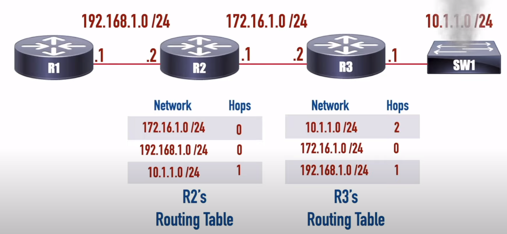

### Poison reverse
- Gửi tuyến với hop count vô tận cho một tuyến không tới được 

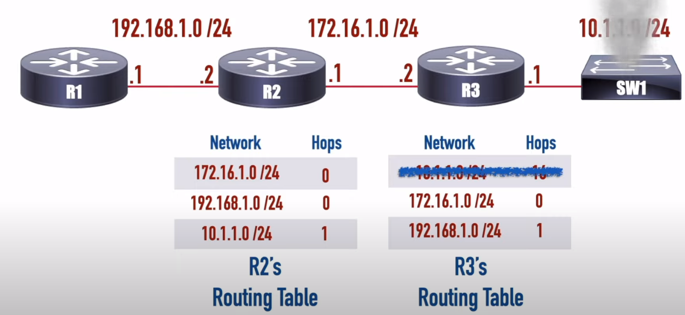


### 1.5 Điểm mạnh và yếu 
#### Điểm mạnh
- Dễ cấu hình
- Dễ hiểu 
- Tự cập nhật khi topology thay đổi
- Thường có cơ chế tránh lặp 
#### Điểm yếu 
- Overhead lớn cho việc cập nhật 
- Không phải lúc nào cũng tránh được lặp 
- Chỉ hỗ trợ cân bằng tải equal-cost 
- Chỉ dùng được cho mạng nhỏ (vì hop count < 16)


# 2. EIGRP 
## 2.1 Cơ bản 
- Tính năng cân bằng tải unequal-cost 
- Hỗ trợ tối đa 255 lần nhảy
- Sử dụng thuật toán diffusing update để tìm đường đi
- EIGRP sử dụng metric khác ngoài hop count như link speed và delay 

### Autonomous system 

Một router có thể chạy nhiều tiến trình EIGRP. Mỗi tiến trình thực thi dưới một autonomous system, mô tả miền định tuyến. Routers trong cùng miền sử dụng cùng công thức tính metric và trao đổi tuyến với các thành viên cùng miền. 

Hình 7-1, AS 100 gồm R1, R2, R3, R4 và AS 200 gồm R3, R5, và R6. Mỗi tiến trình EIGRP tương ứng với một autonomous system, và giữ **một bảng topology EIGRP**. R1 không có tri thức về tuyến từ AS 200 vì nó ở khác AS. R3 có thể tham gia vào cả hai AS và mặc định không chuyển tuyến học được từ AS này sang AS kia. 

### Các thuật ngữ EIGRP 

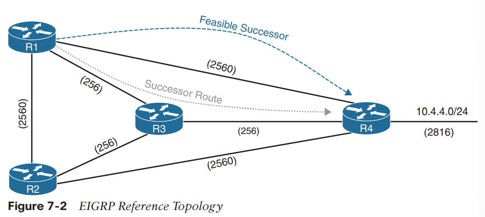

Hình 7-2 minh họa R1 tính đường đi tốt nhất và các đường đi không lặp khác tới mạng 10.4.4.0/24. Mỗi giá trị trong ngoặc mô tả một metric của link cho một segment, dựa trên bandwidth và delay 

Bảng dưới liệt kê một vài thuật ngữ tương quan với Hình 7-2 

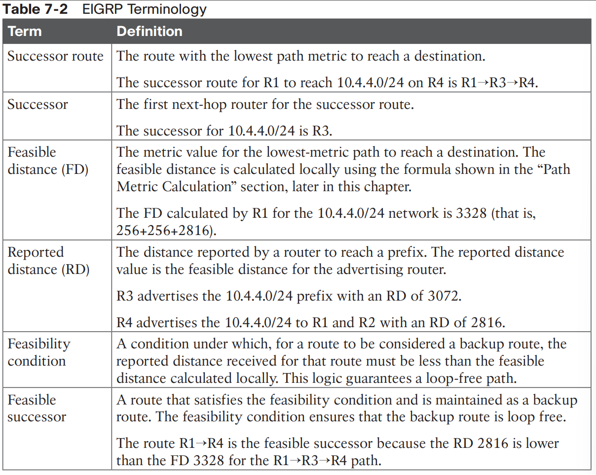


### Topology Table 

- EIGRP có một *bảng topology*
- Bảng topology cung cấp thông tin quan trọng cho DUAL, để tìm được các tuyến dự phòng không lặp. 
- Bảng topology chứa tất cả các mạng được thông bao bên trong AS. 
- Mỗi phần tử trong bảng gồm 
  - Network prefix 
  - Hàng xóm thông báo prefix đó 
  - Metrics từ mỗi hàng xóm (reported distance, hop count)
  - Giá trị dùng để tính metric (load, reliability, total delay, minimum bandwidth)

Hình 7-3 minh họa bảng topology cho R1 trong Hình 7-1. 

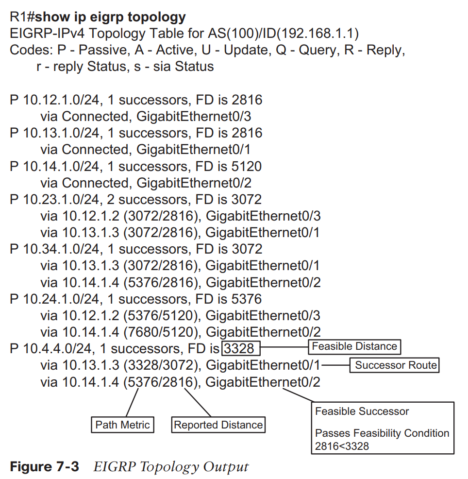

### Hàng xóm EIGRP 
- Trao đổi thông định định tuyến 
- Chỉ thông báo cập nhật khi topology thay đổi 
- Bảng neighbor adjacency dùng để theo dõi trạng thái neighbor và các cập nhật gửi cho mỗi neighbor 

EIGRP sử dụng 5 loại packet để giao tiếp với các router khác, được minh họa trong Bảng 7-3. EIGRP sử dụng số protocol (88); sử dụng packet multicast khi có thể và unicast khi cần thiết. Giao tiếp giữa các router thông qua multicast và sử dụng địa chỉ nhóm 224.0.0.10 khi có thể. 

## 2.2 Tính path metric 

- Sử dụng nhiều yếu tố để tính metric cho đường đi. 
- Mặc định dùng *bandwidth* và *delay*, có thể bao gồm *interface load* và *reliability*. 

Công thức ở Hình 7-4, là công thức EIGRP cổ điển 

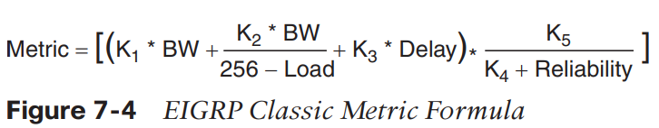

Công thức EIGRP dựa trên công thức IGRP, đầu ra được nhân vói 256 để từ 24 bit lên 32 bit. Công thức cho EIGRP được cho trong Hình 7-5. 

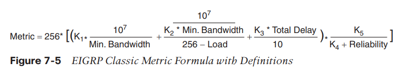


Mặc định K<sub>1</sub>, K<sub>3</sub> là 1, K<sub>2</sub>, K<sub>4</sub>, và K<sub>5</sub> là 0. Hình 7-6 là công thức ngắn gọn EIGRP. 

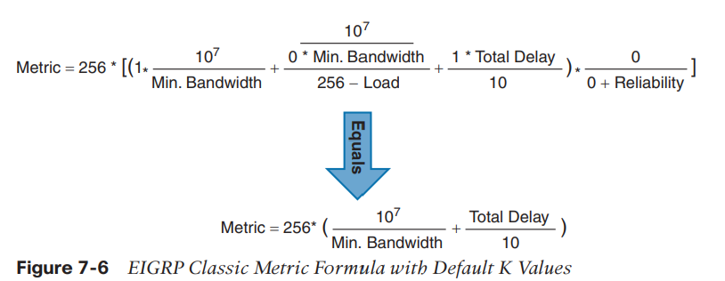

Hình 7-7 minh họa thông tin packet EIGRP update cho 10.1.1.0/24 lan qua AS. Hop count tăng, minimum bandwidth giảm, tổng trễ tăng, và RD thay đổi với mỗi router trong AS

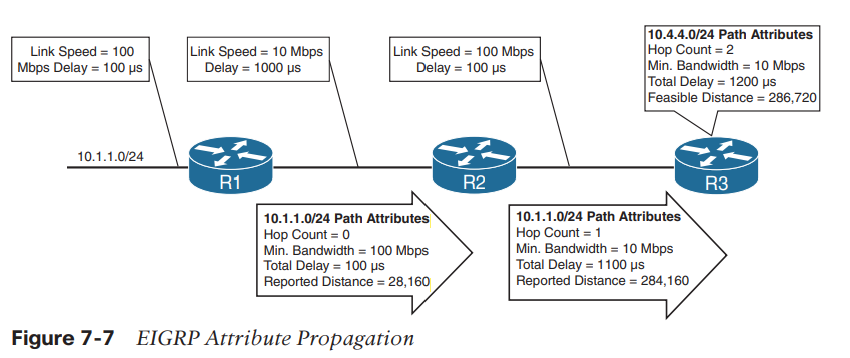

Bảng 7-4 mô tả các loại mạng phổ biến, link speed, delay và, EIGRP metric sử dụng công thức từ Hình 7-6 

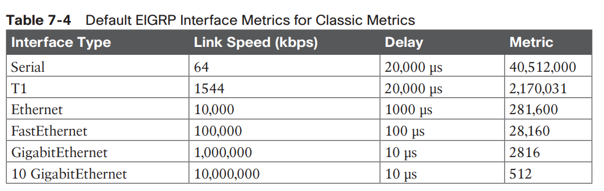

Ví dụ tính Metric từ R1 cho mạng 10.4.4.0/24 

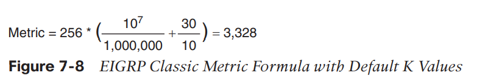

### Cân bằng tải 
- EIGRP cho phép nhiều successor routes nạp vào RIB. Được gọi là equal-cost multipathing (ECMP). Khi traffic muốn đến cùng một đích, chia đều ra giữa các tuyến successor. 

- EIGRP hỗ trợ cân bằng tải unequal-cost, cho phép nạp successor routes và các feasible successor vào RIB. 

EIGRP hỗ trợ cân bằng tải unequal-cost bằng cách thay đổi giá trị *variance mutiplier*. Giá trị *variance multiplier* là do người dùng định nghĩa

Nếu metric của tuyến nhỏ hơn *variance value* và RD của tuyến (Reported Distance) nhỏ hơn FD (của tuyến successor) thì tuyến đó sẽ được nạp vào RIB 

Công thức tính variance value
```
variance value = FD * variance multipler 
```

[Ví dụ](https://community.cisco.com/t5/networking-knowledge-base/troubleshooting-eigrp-variance-command/ta-p/3129662)

## 2.3 Phát hiện lỗi và Timers 
- Chức năng thứ hai của EIGRP hello packet là đảm bảo hàng xóm EIGRP vẫn ổn 
- Các hello packets được gửi theo chu kì quyết định bởi hello timer. Hello timer mặc định là 5 giây, có thể là 60 giây trên giao diện chậm 
- EIGRP sử dụng một timer nữa cho *hold time (thời gian giữ)* giá trị mặc định gấp 3 lần chu kỳ hello: 15s, 180s cho giao diện chậm
- Hold time là khoảng thời gian tối đa không nhận hello packet, khi router nhận được một hello packet hold time được reset về giá trị ban đầu, nếu giá trị này tới 0, router coi hàng xóm không tới được (Báo cho hàng xóm thời gian đợi trước khi coi router chết)

### Convergence (Hội tụ)

- Khi EIGRP phát hiện một liên kết thuộc tuyến successor chết, feasible successor lập tức trở thành tuyến successor.

#### Có feasible successor 
Hình 7-13 minh họa tình huống khi liên kết giữa R1 và R3 hỏng 

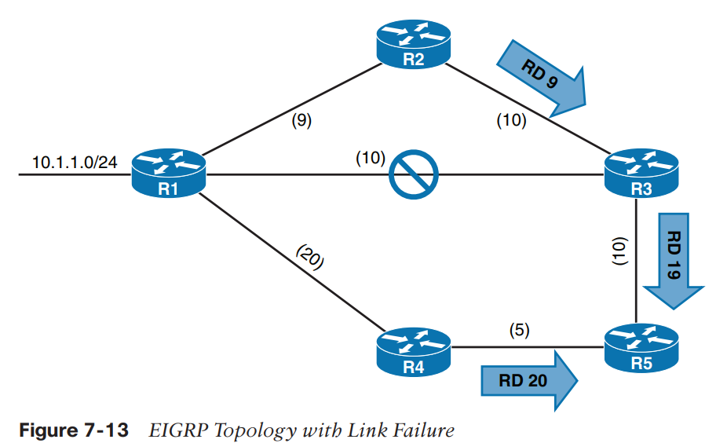

R3 nạp feasible successor từ R2 thành tuyến successor. R3 gửi update packet với RD 19 cho mạng 10.1.1.0/24. R5 nhận update packet từ R3 và tính Fd 29 cho đường R1->R2->R3 cho 10.1.1.0/24. R5 so sánh đường đó với đuòng nhận được từ R4, có metric là 25. R5 chọn đường R1->R4 làm successor route. 


#### Không có feasible successor 
Nếu không có feasible successor. DUAL phải tính lại tuyến. Trạng thái của tuyến thay đổi từ passive (P) sang active (A) trong bảng topology 

Router phát hiện thay đổi topology và gửi những query packet tới hàng xóm. Query packet bao gồm network prefix với delay đặt làm vô cùng để các router khác biết được là nó đang active. Khi router gửi query packet, nó đặt cờ status cho mỗi neighbor 

Khi nhận được một query packet, EIGRP router sẽ
- Có thể phản hồi lại truy vấn thông báo nó không có tuyến tới prefix 
- Nếu query không tới từ router thuộc successor, router nhận sẽ phản hồi với thuộc tính EIGRP cho tuyến đó 
- Nếu query tới từ router thuộc successor, router nhận thấy delay đặt vô tận, đặt prefix làm active trong EIGRP topology, và gửi query packet cho tất cả hàng xóm cho tuyến đó. 

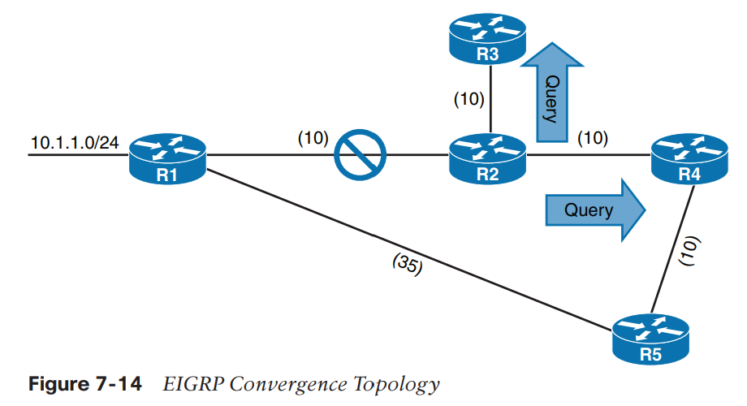

# 3. OSPF 

## 3.1 Cơ bản 
- OSPF gửi link-state advertisements (LSAs) chứa trạng thái link và metric link cho các router hàng xóm. 
- Các router nhận LSAs lưu chúng trong cơ sở dữ liệu cục bộ gọi là link-state database (LSDB), chúng được "ngập" qua miền định tuyến OSPF 
- Tất cả OSPF routers giữ một bản LSDB giống hệt nhau cho cùng một khu vực 
- LSDB cung cấp topology cho network, tức là nó cung cấp cho router bản đồ mạng 
- Tất cả OSPF routers chạy thuật toán Dijkstra shortest path first (đường đi ngắn nhất) để xây dựng một topology không có lặp các đường đi ngắn nhất. 
- OSPF phát hiện thay đổi topology và tính toán lại các đường đi không lặp trong thời gian ngắn 
- Mỗi router coi bản thân là root của cây SPF (SPT), SPT chứa tất cả các mạng đích bên trong miền OSPF. SPT khác nhau với mỗi router, nhưng LSDB được dùng để xây SPT là giống nhau cho tất cả các routers. 

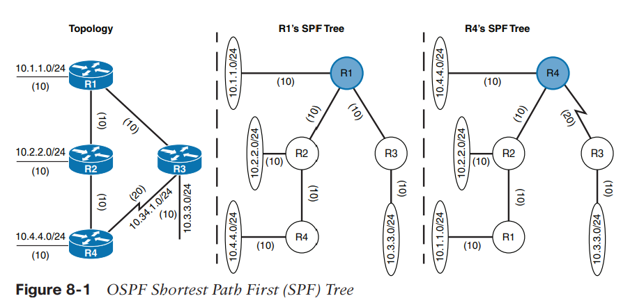

- OSPF cung cấp khả năng mở rộng bằng cách sử dụng nhiều OSPF areas trong một miền định tuyến. 
- Mỗi OSPF area chứa một tập các mạng và host được nhóm với nhau. 
- OSPF sử dụng kiến trức hai mức, trong đó Area 0 là một khu vực (area) đặc biệt gọi là backbone, các area khác phải connect vào area này 
- Các nonbackbone areas sẽ thông báo tuyến cho backbone, và backbone sẽ chuyển các tuyến đó tới các nonbackbone areas khác. 

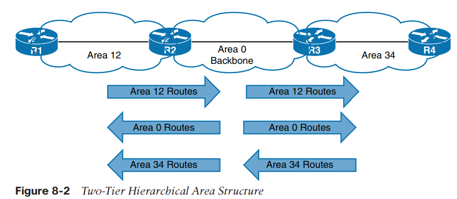

- Một area không nhìn thấy topology của area khác
- Router bên ngoài một area không có bản đồ mạng cho area đó, giảm OSPF traffic. 
- Khi chia miền định tuyến OSPF thành nhiều areas, các OSPF routers trong cùng area sẽ có cùng LSDBs, các routers khác area sẽ có LSDBs khác nhau.  

## 3.2 Giao tiếp giữa các routers
- OSPF chạy trên IPv4, sử dụng giao thức của chính nó 89, được giữ lại cho OSPF bởi IANA (Internet Assigned Number Authority)
- OSPF sử dụng multicast khi có thể để giảm thiểu traffic không cần thiết. Hai địa chỉ OSPF multicast là như sau
  - AllSPFRouters: Địa chỉ IPv4: 224.0.0.4 hoặc địa chỉ MAC 01:00:5E:00:00:05. Tất cả routers chạy OSPF sẽ nhận được packets gửi cho địa chỉ trên 
  - AllDRouters: Địa chỉ IPv4: 224.0.0.6 hoặc địa chỉ MAC 01:00:5E:00:00:06. Tất cả *designated router (DR)* sẽ nhận được packets gửi cho địa chỉ trên 

## 3.3 Các loại packet OSPF 

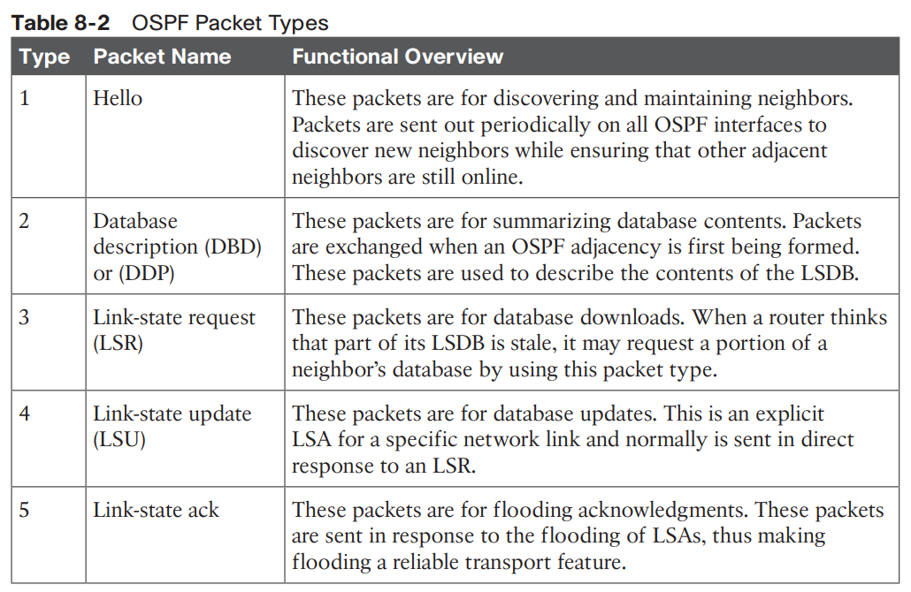

### 3.3.1 OSPF Hello Packets

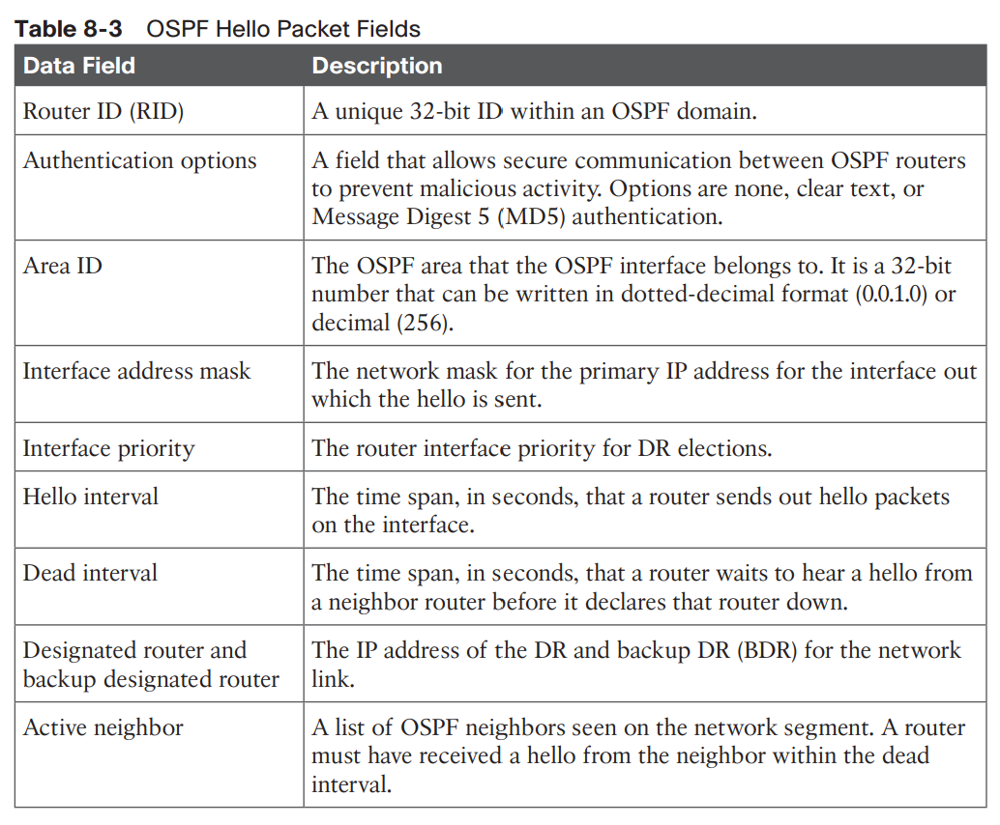

#### Router ID 
- Định danh OSPF router trong miền OSPF 
- Số 32-bit 
- Thuật ngữ *neighbor ID* và *RID* là giống nhau
- Nếu một router có nhiều tiến trình OSPF, RID cho mỗi tiến trình đó phải khác nhau (dĩ nhiên cũng phải độc nhất trong miền OSPF)

#### Neighbors 
- OSPF neighbor là một router chia sẻ chung liên kết mạng có sử dụng OSPF. 
- Các OSPF routers phát hiện các hàng xóm sử dụng OSPF hello packets. OSPF neighbor kề là OSPF neighbor chia sẻ một cơ sở dữ liệu OSPF được đồng bộ giữa hai hàng xóm. 
- Mỗi tiến trình OSPF giữ một bảng các hàng xóm kề và trạng thái của mỗi router.  

#### Designated Router và Backup Designated Router 
- Mạng multi-access như Ethernet LÁN cho phép nhiều hơn hai routers bên trong một network segment => **Vấn đề về mở rộng với OSPF khi số routers trên một segment tăng (số lượng routers làm ngập segment với LSAs tăng)**

Ví dụ:
4 routers cùng ở trong mạng multi-access, sẽ hình thành nên 6 OSPF adjacencies., 

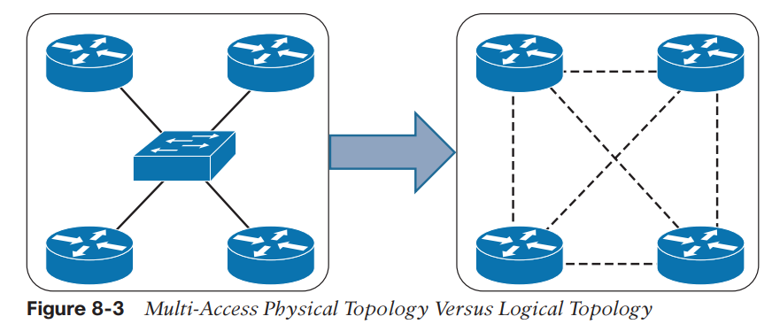

- OSPF giải quyết vấn đề trên bằng cách tạo ra một pseudonode (virtual router - router ảo) để quản lý trạng thái adjacency với tất cả các router khác
- DR giảm OSPF adjacencies trên một phần mạng multi-access 
- DR quảng bá cập nhật tớitaats cả các OSPF routers trên phần mạng khi có cập nhật 

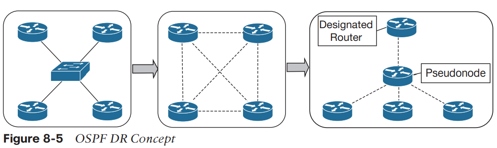

Nếu DR hỏng, BDR (Backup designated router) sẽ trở thành DR mới; sau đó quá trình bầu chọn diễn ra để thay thế BDR 

Quá trình DR/BDR phân phối LSAs:

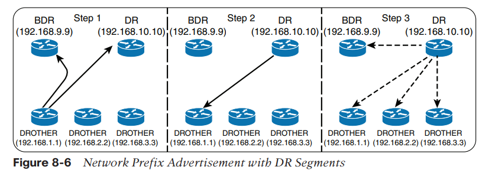

1. Tất cả các OSPF routers (DR, BDR, DROTHER) trên một segment có full adjacencies với DR và BDR 
2. Khi một router OSPF học được một tuyến mới, nó gửi LSA mới cho địa chỉ AllDRouter (224.0.0.6), chỉ có DR và BDR mới nhận được, như trong Bước 1 Hình 8-6 
3. DR gửi unicast ack cho router gửi cập nhật LSA, như trong Bước 2 Hình 8-6. 
4. DR quảng bá LSA cho tất cả các routers trên segment thông qua địa chỉ ALLSPFRouters (224.0.0.5), như trong Bước 3 Hình 8-6