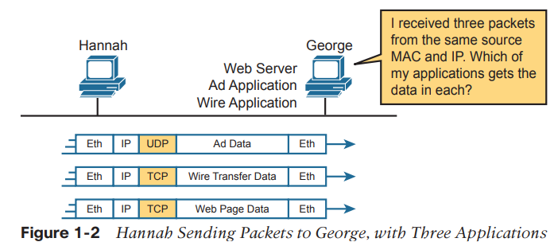
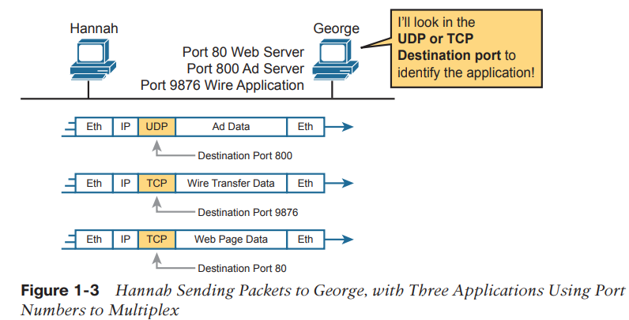

# TCP và UDP 

Tầng transport OSI (Tầng 4) định nghĩa nhiều chứng năng, hai chức năng quan trọng nhất là
- Phục hồi lỗi 
- Kiểm soát luồng 

Điểm khác biệt chính của TCP và UDP là, TCP cung cấp nhiều loại dịch vụ cho ứng dụng, UDP thì không. Ví dụ, một router hủy packet vì nhiều lý do (phần lớn các giao thức data-link, phát hiện lỗi sau đó hủy frame có lỗi). **TCP cung cấp phục hồi lỗi và tránh tắc nghẽn (kiểm soát luồng), UDP thì không. Vì vậy, nhiều giao thức application sử dụng TCP.**

Tuy nhiên, vì UDP cung cấp ít dịch vụ hơn, nó cần ít byte trong phần header so với TCP => ít overhead trong mạng. Các phần mềm sử dụng UDP không làm chậm quá trình chuyển dữ liệu trong khi TCP thì có thể ngược lại. Một số ứng dụng, tiêu biểu là Voice over IP (VoIP) và video over IP, không cần phục hồi lỗi, nên chúng sử dụng UDP. 

Bảng 1-2 liệt kê các tính năng chính hỗ trợ bởi TCP/UDP. (UDP chỉ hỗ trợ chức năng đầu tiên - Multiplexing using ports, TCP hỗ trợ hết) 

## 1. Transmission Control Protocol (TCP)
- TCP dựa vào IP để chuyển dữ liệu, bao gồm việc định tuyến. 
- Vai trò của TCP là cung cấp dịch vụ cho các ứng dụng ở các máy tính endpoint. 
- Không quan trọng hai máy tính đang cùng Ethernet, hay ngăn cách bởi Internet, chức năng của TCP là như nhau 

Hình 1-1 là các trường trong TCP header. 

Thông điệp tạo ra bởi TCP bắt đầu bằng TCP header, sau đó là dữ liệu application, được gọi là một TCP segment. Thuật ngữ khác có thể sử dụng là *Layer 4 PDU* 

### 1.1 Multiplexing sử dụng số hiệu cổng TCP 
TCP và UDP đều sửd ụng một khái niệm gọi là *multiplexing*. 

Multiplexing với TCP và UDP liên quan tới quá trình máy tính xử lý dữ liệu nhận được. Máy tính có thể chạy nhiều ứng dụng, như là trình duyệt web, ứng dụng Internet VoIP (như Skype). TCP và UDP multiplexing cho phép máy tính biết phải gửi dữ liệu nhận được cho ứng dụng nào. 

Hình 1-2 minh họa một mạng, trong đó Hannah gửi thông điệp cho George thông qua ba ứng dụng sử dụng TCP và UDP 
- Ứng dụng quảng cáo sử dụng UDP 
- Ứng dụng chuyển khoản sử dụng TCP
- Ứng dụng web browser sử dụng TCP (Hannah sử dụng web browser để truy cập vào web server ở trên George)

George cần biết đưa dữ liệu cho ứng dụng nào, nhưng cả ba packets đều tới cùng địa chỉ Ethernet và IP. 

TCP và UDP giải quyết vấn đề trên bằng cách sử dụng một trường **port number** trong header TCP hoặc UDP. Cụ thể, mỗi header TCP và UDP của Hannah sử dụng một *số hiệu cổng đích (destination port number)* khác nhau để George biết đưa dữ liệu cho ứng dụng nào. 

Multiplexing dựa vào một khái niệm gọi là *socket*. Một socket gồm ba thứ:
- Địa chỉ IP 
- Giao thức transport 
- Số hiệu cổng 

Đối với ứng dụng web server ở trên George, socket sẽ là (10.1.1.2, TCP, port 80) vì, mặc định web server sử dụng cổng 80. Khi web browser của Hannah kết nối tới web server, Hannah cũng sử dụng một socket - có thể là (10.1.1.1, TCP, 49160). Tại sao lại là 49160 ? Vì Hannah chỉ cần một số hiệu cổng độc nhất với Hannah, nên Hannah sử dụng 49160 

Internet Assigned Numbers Authority (IANA), tổ chức mà cũng quản lý cấp phát địa chỉ IP trên toàn thế giới, chia số hiệu cổng thành ba miền. Hai miền đầu tiên được giữ lại để IANA cấp phát cho các giao thức application, miền thứ ba là các số hiệu cổng có thể được cấp phát động để sử dụng cho clients, như cổng 49160 trong ví dụ. 
- Well Known (System) Ports: 0 tới 0123, quá trình review nghiêm ngặt khi gán cổng mới 
- User (Registered) Ports: 1024 tới 49151, quá trình review ít nghiêm ngặt hơn so với System port
- Ephemeral (Dynamic, Private) Ports: 49152 tới 65535, không được gán và được gán động sử dụng tạm thời cho ứng dụng client khi nó đang chạy 

### 1.2 Các ứng dụng TCP/IP phổ biến 

- World WIde Web (WWWW) tồn tại thông qua web browsers truy cập dữ liệu có trên các web servers. Mặc dù nó thường được dùng làm ứng dụng end-user, bạn có thể sử dụng WWW để quản lý router hoặc switch, kích hoạt chức năng web server trên router hoặc switch và sử dụng browser để truy cập vào router hoặc switch. 
- Domain Name System (DNS) cho phép người dùng tham chiếu tới các máy tính sử dụng tên thay vì địa chỉ IP, và DNS được sử dụng để tìm địa chỉ IP tương ứng. DNS sử dụng mô hình client/server, DNS server được kiểm soát bởi tổ chức mạng và DNS client thì là phần lớn các thiết bị sử dụng TCP/IP. Client chỉ hỏi DNS server cung cấp địa chỉ IP tương ứng với tên được cung cấp. 
- Simple Network Management Protocol (SNMP) là một giao thức tầng application sử dụng để quản lý các thiết bị mạng. Ví dụ, Cisco cung cấp nhiều sản phẩm quản lý mạng. Chúng có thể được sử dụng để truy vấn, lưu, hiển thị thông tin về thao tác mạng. Để truy vấn các thiết bị mạng, phần mềm Cisco Prime chủ yếu sử dụng giao thức SNMP. 
- Để chuyển files từ một router hay switch. Cisco sử dụng Trivial File Transfer Protocol (TFTP). Các routers và switch cũng có thể sử dụng File Transfer Protocol (FTP), cung cấp nhiều tính năng hơn TFTP, là lựa chọn phổ biến cho phần lớn end-user (ngoài ra còn có FTPS và SFTP để truyền dữ liệu bảo mật). TFTP rất đơn giản, phù hợp với các phần nhúng của các thiết bị mạng 
- Simple Mail Transfer Protocol (SMTP) sử dụng để gửi và nhận e-mail, thường được sử dụng với Post Office Protocol version 3 (POP3) để lưu e-mail trên server, và truyền
e-mail cho người dùng 

Các ứng dụng sử dụng các cổng thông dụng, để client biết kết nối với cổng nào. Bảng 1-3 liệt kê nhiều ứng dụng và các cổng phổ biến mà chúng dùng                                                                                              

### 1.3 Thiết lập và hủy kết nối 
 
#### Thiết lập kết nối TCP
- Kết nối TCP được thiết lập trước khi bất kì tính năng TCP nào khác được sử dụng. 

- Thiết lập kết nối là quá trình khởi tạo các trường Sequence và Acknowledgement và chấp thuận sử dụng số hiệu cổng nào. 

Hình 1-5 minh họa quá trình thiết lập kết nối.

Thiết lập kết nối (hay còn được gọi là bắt tay ba bước), phải được hoàn thiện trước khi chuyển dữ liệu. Kết nối tồn tại giữa hai sockets, mặc dù TCP header không có trường socket. Một trong ba phần của socket, địa chỉ IP được truyền thông qua IP header. TCP được ngầm hiểu, vì đang sử dugnj TCP header. Vì vậy, phần duy nhất của socket mà cần được mã hóa vào TCP header là số hiệu cổng. 

TCP báo hiệu thiết lập kết nối sử dụng 2bit bên trong trường flag của TCP header, gọi là SYN và ACK, hai bit này có ý nghĩa thú vị, SYN có nghĩa là "synchronize the sequence numbers". ACK có nghĩa là "acknowledgement". 

#### Hủy kết nối TCP 
Hình 1-6 minh họa hủy kết nối TCP. Quá trình hủy 4 bước đơn giản và sử dụng thêm một cờ, gọi là FIN bit (FINISHED). 

TCP thiết lập và hủy kết nối giữa endpoints, UDP thì không. Nhiều giao thức hoạt động dưới cùng khái niệm, này nên thuật ngữ *connection-oriented (hướng kết nối)* và *connetionless* được dùng để nói về ý tưởng chung. CỤ thể các thuật ngữ này có thể định nghĩa như sau
- Connection-orientd protocol: Một giao thức yêu cầu trao đổi thông điệp trước khi truyền dữ liệu hoặc có một liên kết được thiết lập từ trước giữa hai endpoints
- Connectionless protocol: MỘt giao thức không yêu cầu trao đổi dữ liệu và không yêu cầu liên kết thiết lập từ trước giữa hai endpoints 

### 1.4 Phục hồi lỗi và tính tin cậy 
TCP cung cấp tính tin cậy để truyền dữ liệu, cũng được gọi là *phục hồi lỗi*. Để đạt được tính tin cậy, TCP đánh số các bytes sử dụng các trường Sequence và Acknowledgement trong TCP header. TCP đạt được tính tin cậy từ cả hai hướng, sử dụng Sequence Number cho một hướng kết hợp với Acknowledgement ở hướng còn lại. 

Hình 1-7 minh họa ví dụ trường TCP Sequence và Acknowledgement cho phép PC gửi 3000 bytes dữ liệu tới server. 

Cơ chế phục hồi lỗi của TCP có nhiều biến thể. Hình 1-8 minh họa một ví dụ, về cơ chế phục hồi lỗi TCP. 

### 1.5 Điều khiển luồng sử dụng cơ chế cửa sổ 
- TCP cài đặt điều khiển luồng bằng cách sử dụng khái niệm cửa sổ
- Cơ chế cửa sổ cho phép host nhận báo cho sender số lượng dữ liệu nó có thể nhận tại thời điểm hiện tại, cho phép host nhận có cách để làm host gửi gửi nhanh hơn hoặc chậm lại. 
- Bên gửi có thể trượt kích thước cửa sổ lên hoặc xuống - gọi là *sliding window (cửa sổ trượt)* để thay đổi số lượng dữ liệu host gửi có thể gửi. 

## 2. User Datagram Protocol

- UDP không có hướng kết nối 
- UDP không có cơ chế cửa sổ
- UDP không tin cậy, không sắp xếp lại dữ liệu nhận được, không phân đoạn dữ liệu thành các phần nhỏ để truyền. (Các ứng dụng sử dụng UDP phải tự cung cấp cơ chế phụ hồi dữ liệu, sắp xếp dữ liệu nhận được, và phân đoạn trước khi gửi)

- UDP cung cấp một vài tính năng giống như tCP như là, multiplexing sử dụng số hiệu cổng, và nó làm vậy với ít bytes overhead hơn TCP 

Ứng dụng phổ biến của UDP như 
- VoIP truyền âm thanh qua mạng trực tiếp
- Video over IP truyền video qua mạng trực tiếp 
- Các yêu cầu DNS cũng sử dụng UDP vì người dùng sẽ thử lại nếu phân giải DNS thất bại 
- Network File System (NFS), ứng dụng hệ thống file từ xa, cung cấp phục hồi lỗi với code tầng application, nên có thể sử dụng UDP 

Hình 1-10 minh họa định dạng UDP header. 

