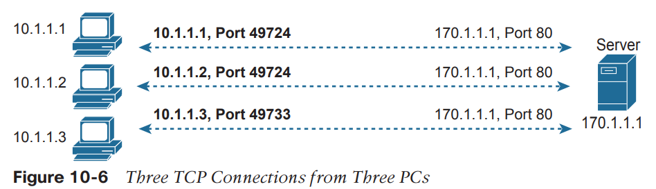
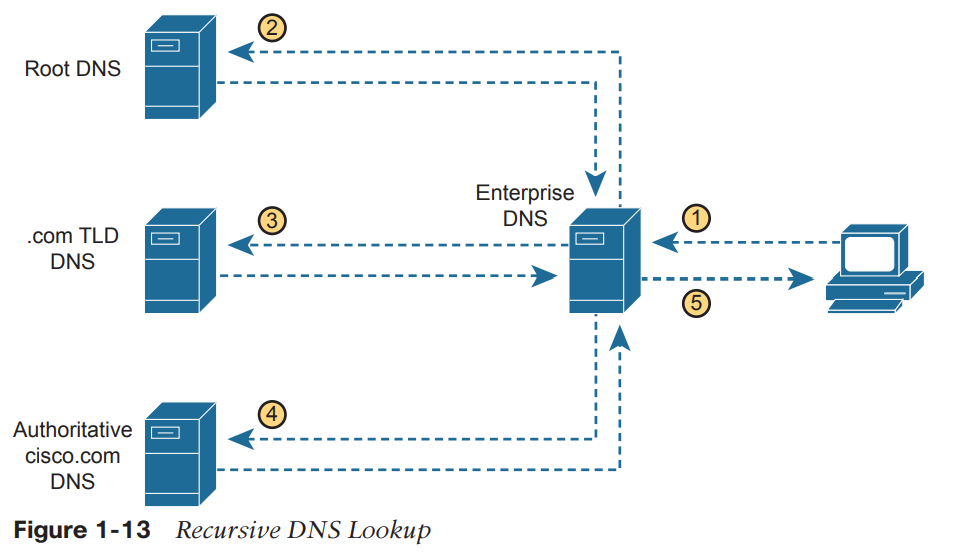

# NAT 

## 1. Tính mở rộng của địa chỉ IPv4 
- Thiết kế ban đầu của Internet yêu cầu mỗi tổ chức yêu cầu, nhận, một hoặc nhiều hơn IPv4 classful. 
- Internet Assigned Numbers Authority (IANA) quản lý việc cấp phát địa chỉ IP 
- Nếu mỗi tổ chức sử dụng địa chỉ IP bên trong dải địa chỉ mà đã đăng kí, các địa chỉ IP sẽ không bao giờ bị trùng lặp

- Vào những năm 1990s, sự phát triển rất nhanh của Internet khiến cho địa chỉ IP cạn kiện. 

=> Giải pháp dài hạn cho vấn đề này là tăng kích thước của địa chỉ IP từ đó ra đời IPv6. IPv6 có thể hỗ trợ tất cả tổ chức và cá nhân trên hành tinh vì trên lý thuyết số địa chỉ IPv6 là 2128

=> Nhiều giải pháp ngắn hạn cho vấn đề địa chỉ được đề xuất, nhưng ba chuẩn hoạt động với nhau để giải quyết vấn đề này. Hai chuẩn hoạt động gần nhau: 
- Network Address Translation (NAT)
- private addressing

 Những tính năng này cho phép các tổ chức sử dụng các địa chỉ IPv4 giống nhau trong nội bộ - và vẫn có thể giao tiếp với Internet. 

- Chuẩn thứ ba: classless interdomain routing (CIDR), cho phép ISPs giảm lãng phí địa chỉ IPv4 bằng cách gán cho một công ty một tập con của các địa chỉ có thể sử dụng thay vì tất cả. 

### 1.1 CIDR 
CIDR là một quy chuẩn gán địa chỉ toàn cục định nghĩa cách Internet Assigned Numbers Authority (IANA), các doanh nghiệp thành viên, các ISPs gán không gian địa chỉ IPv4 toàn cục cho các tổ chức riêng. 

CIDR, được định nghĩa trong RFC 4632, có hai mục tiêu chính. Đầu tiên, CIDR định nghĩa một cách để gán địa chỉ IP public, trên toàn thế giới, cho phép route summerization. Giảm kích cỡ của bảng định tuyến trên các routers 

Hình 10-1 minh họa một ví dụ CIDR route summerization và cách CIDR được sử dụng để thay thế hơn 65,000 tuyến với 1 tuyến. Đầu tiên, tưởng tượng rằng ISP 1 sở hữu các mạng lớp C 198.0.0.0 tới 198.255.255.0 (IANA cấp phát địa chỉ bắt đầu với 198 cho một trong năm Regional Internet Registries - RIR, RIR gán cả khoảng này cho một ISP).

Việc gán tất cả các địa chỉ bắt đầu bằng 198 cho một ISP cho phép các ISPs khác sử dụng một tyến - tuyến 198.0.0.0/8 - để match tất cả các địa chỉ, chuyển tiếp packet tới những địa chỉ đó tới ISP1. Hình 10-1 minh họa ISPs bên trái mỗi ISP có một tuyến tới 198.0.0.0/8 - nói cách khác một tuyến tới tất cả các hosts có địa chỉ IP bắt đầu với 198. 

Điểm mạnh thứ hai của CIDR là cho phép RIRs và ISPs giảm thiểu lãng phí bằng cách gán một tập con mạng cho một khách hàng. Ví dụ, khách hàng A của ISP1 chỉ cần 10 địa chỉ IP, và khách hàng C cần 25 địa chỉ IP. ISP1 sẽ làm như sau 
- Gán cho khách hàng A một CIDR block 198.8.3.16/28, với 14 địa chỉ có thể sử dụng được (198.8.3.17 -> 198.8.3.30)
- Gán cho khách hàng B một CIDR block 198.8.3.32/27, với 30 địa chỉ có thể sử dụng được (198.8.3.33 -> 198.8.3.62)

### 1.2 Private Addressing 

Một số máy tính có thể không bao giờ cần kết nối tới Internet. Địa chỉ IP của các máy tính có thể trùng với địa chỉ IP đã được đăng kí ở trên Internet. 

Khi thiết kế quy chuẩn địa chỉ IP cho một mạng như vậy, một tổ chức có thể chọn và sử dụng bất kì địa chỉ nào mà nó muốn. Ví dụ, bạn có thể mua một vài routers, kết nối chúng và cấu hình địa chỉ IP trong mạng 1.0.0.0, và nó sẽ hoạt động. Địa chỉ IP bạn dùng có thể bị trùng với địa chỉ IP trên Internet, nhưng nếu bạn chỉ muốn một lab trong văn phòng, mọi thứ vẫn okay. 

Khi xây một mạng riêng không có kết nối Internet, bạn có thể dùng các địa chỉ được gọi là *private internets*, được định nghĩa ở RFC 1918, *"Address Allocation for Private Internets (Địa chỉ được cấp phát cho mạng riêng)*. RFC định nghĩa một tập các mạng không bao giờ được gán. Thay vì sử dụng một địa chỉ được đăng kí bởi ai đó, bạn có thể dùng các địa chỉ trong khoảng mà không ai dùng trên Internet. Bảng 10-2 cho thấy không gian địa chỉ private định nghĩa bởi RFC 1918. 

Nói cách khác, tổ chức nào cũng có thể dùng các dải địa chỉ trên. Tuy nhiên, không tổ chức nào được phép sử dụng mạng với địa chỉ trong dải trên để giao tiếp trên Internet. 

Bảng 10-3 tóm tắt các tính năng quan trọng giúp kéo dài sự sống của IPv4. 

## 2. Các khái niệm về Network Address Translation 

- NAT cho phép một host không có một địa chỉ IP độc nhất toàn cục, hợp lệ, đã đăng kí, giao tiếp với các hosts khác thông qua Internet. 
- Các hosts có thể sử dụng private address hoặc address được gán bởi tổ chức khác. Trong cả hai trường hợp, NAT cho phép hosts sử dụng các địa chỉ trên giao tiếp với nhau. 
- NAT sử dụng một dịa chỉ IP hợp lệ đã đăng kí để đại diện cho địa chỉ private để giao tiếp qua Internet. 
- Chức năng của NAT là thay thế địa chỉ IP private thành địa chỉ IP đã được đăng kí bên trong mỗi IP packet, như trong Hình 10-2

Khi nhận được một packet router sử dụng NAT để thay đổi địa chỉ đích ở mỗi packet rồi mới chuyển tiếp vào mạng riêng. 

Phần này bàn về *source NAT*, là loại NAT chuyển IP inside private thành IP inside global để giao tiếp được với Internet. 

### 2.1 Static NAT (NAT tĩnh)

Hoạt động giống như Hình 10-2, những các địa chỉ IP được ánh xạ tĩnh. Hình 10-3 minh họa ví dụ tương tự với thêm thông tin 

NAT router thay đổi địa chỉ IP nguồn trong packet. 

Trong ví dụ này, NAT router thay đổi địa chỉ nguồn 10.1.1.1 thành 200.1.1.1. Với NAT tĩnh, NAT router cấu hình ánh xạ 1-1 giữa địa chỉ private và địa chỉ public. 

Để hỗ trợ một IP host thứ hai với static NAT cần một ánh xạ tĩnh 1-1 sử dụng một địa chỉ IP public thứ hai. Ví dụ để hỗ trợ 10.1.1.2, router ánh xạ tĩnh 10.1.1.2 tới 200.1.1.2. Bởi vì doanh nghiệp có một mạng lớp C, nó có thể hỗ trợ nhiều nhất 254 địa chỉ IP với NAT (2 địa chỉ được giữ lại không dùng - network number và network broadcast address).

Host cần hai địa chỉ khác nhau để mô tả bản thân nó, nó cần hai thuật ngữ 

Thuật ngữ với NAT bởi Cisco 
- inside local: cho các địa chỉ IP private 
- inside global: cho địa chỉ public dùng để đại diện cho địa chỉ IP private với phần còn lại của Internet. 

*Lưu ý*: *destination NAT*, sử dụng thuật ngữ *outside local* và *outside local*. Đối với source NAT, thuật ngữ *outside global* cũng được sử dụng. Thuật ngữ này được dùng để nói tới host ở bên ngoài doanh nghiệp. 

### 2.2 Dynamic NAT (NAT động)

- Giống như static NAT, NAT router tạo ánh xạ 1-1 giữa địa chỉ inside local và inside global, thay đổi địa chỉ IP trong packet khi chúng đi ra và vào mạng 
- Quá trình ánh xạ địa chỉ inside local ra inside global hoạt động một cách động 

Dynamic NAT thiết lập một pool (danh sách) các địa chỉ inside global và định nghĩa các tiêu chí để quyết định địa chỉ IP local inside nào được dịch với NAT. Ví dụ Hình 10-5, một pool với 5 địa chỉ IP inside global được thiết lập: 200.1.1.1. tới 200.1.1.5. NA cũng được cấu hình để dịch bất kì địa chỉ inside local nào bắt đầu với 10.1.1.

1. Host 10.1.1.1 gửi packet đầu tiên tới server ở 170.1.1.1 
2. Khi packet đi vào NAT router, router áp dụng logic matching để quyết định xem packet có nên được dịch bởi NAT hay không. Vì 10.1.1.1 bắt đầu với 10.1.1 nên router thêm một phần tử vào bảng NAT cho 10.1.1.1 
3. NAT router cần cấp phát địa chỉ IP từ danh sách các địa chỉ inside global dùng được. Nó chọn địa chỉ đầu tiên có thể dùng được (200.1.1.1) và thêm nó vào bảng NAT để hoàn thành 
4. NAT router dịch địa chỉ IP nguồn và chuyển tiếp packet. 

Phần tử động được thêm vào NAT table sẽ ở bên trong bảng nếu traffic đi qua thường xuyên. Bạn có thể cấu hình giá trị timeout định nghĩa khoảng thời gian router đợi không dịch bất kì packet nào với địa chỉ đó, trước khi loại bỏ entry. Cũng có thể xóa các phần tử động bằng tay sử dụng câu lệnh __clear ip nat translation *__

Có thể cấu hình NAT với số lượng địa chỉ inside local nhiều hơn inside global. Router sẽ cấp phát địa chỉ từ pool đến khi không còn. Nếu một packet tới từ một inside host mà không có trong bảng NAT và không còn địa chỉ inside global, NAT router đơn giản hủy packet đó, host đó sẽ phải thử lại khi nào một NAT entry time out. 

**=> Số inside global address phải ít nhất bằng số hosts đồng thời lớn nhất để tất cả hosts sử dụng Internet cùng một lúc (trừ khi sử dụng PAT)**  

### 2.3 Overload NAT với Port Address Translation 

- Với static NAT, với mỗi host sử dụng địa chỉ IP private cần tủy cập Internet, cần một địa chỉ IP public được đăng kí => vô dụng trong việc giảm số lượng địa chỉ IPv4 public. 

- Dynamic NAT tốt hơn một chút, vì mỗi host trong một mạng ít thường xuyên cần truy cập vào Internet cùng một lúc. Tuy nhiên, nếu phần lớn IP hosts trong một mạng cần truy cập vào Internet cùng lúc, NAT vẫn cần một lượng lớn các địa chỉ IP được đăng kí

- Tính năng NAT Overload, cũng được gọi là Port Address Translation giải quyết vấn đề trên. 

- Overload cho phép NAT mở rộng nhiều client chỉ với một vài địa chỉ IP public. 

Mấu chốt để hiểu cơ chế overloading là cách hosts sử dụng cổng cho TCP và UDP. Xét ví dụ, ba kết nối TCP tới một web server, từ ba hosts khác khác nhau trong Hình 10-6

So sánh ba kết nối TCP từ Hình 10-6 với ba kết nối TCP tương tự trong Hình 10-7. 

Từ góc nhìn của tầng transport, server không quan tâm nó đang có một kết nối tới ba hosts khác nhau hay ba kết nối tới một địa chỉ IP. NAT overload (PAT) không chỉ dịch địa chỉ, mà cả số hiệu cổng khi cần thiết, khiến cho nhiều flow TCP hay UDP từ nhiều host trong giống từ một host. 

Khi PAT tạo ánh xạ động, nó không chỉ chọn địa chỉ IP inside global, mà còn chọn một số hiệu cổng độc nhất để sử dụng cùng địa chỉ đó. NAT router giữ một bảng NAT các địa chỉ inside global và cổng tương ứng với địa chỉ inside global. Bởi vì trường port number có 16 bit, NAT overload có thể sử dụng nhiều hơn 65,000 số hiệu cổng, cho phép mở rộng tốt mà không cần nhiều địa chỉ IP được đăng kí - trong nhiều trường hợp chỉ cần một địa chỉ IP inside global. 

PAT là lựa chọn phổ biến nhất. Cả Static NAT và Dynamic NAT đều yêu cầu ánh xạ 1-1 từ inside local tới inside global. PAT giảm thiểu số lượng địa chỉ IP cần đăng kí so với các NAT khác. 
<!-- >
TODO

## 3. Cấu hình NAT và Troubleshooting 

### 3.1 Cấu hình static NAT 

Bước 1: Sử dụng câu lệnh **ip nat inside** trong chế độ cấu hình giao diện để cấu hình các giao diện bên trong NAT 

Bước 2: Sử dụng câu lệnh **ip nat outside** trong chế độ cấu hình giao diện để cấu hình các giao diện bên ngoài NAT 

Bước 3: Sử dụng câu lệnh **ip nat inside source static** *inside-local* *inside-global* trong chế độ cấu hình toàn cục để cấu hình ánh xạ tĩnh 

Hình 10-9 minh họa cấu hình static NAT. 

Hình 10-1 minh họa cấu hình NAT, sử dụng 200.1.1.1 và 200.1.1.2 cho hai ánh xạ tĩnh 

< -->

# DNS 
## 1. Cơ bản

Nếu dns không tồn tại, mỗi lần bạn truy cập vào một trang web, bạn phải sử dụng địa chỉ IP của nó. Ví dụ, thay vì sử dụng google.com hay faceboook.com, bạn phải nhớ và gõ địa chỉ IP ra, như 64.233.177.100. Cách này không thân thiện với người dùng cuối. 

May mắn, TCP/IP định nghĩa một cách để sử dụng *hostname* để định danh các máy tính khác. Người dùng chỉ cần sử dụng hostname, và giao thức sẽ biết được các thông tin cần thiết để cho phép giao tiếp dựa trên hostname. 

Ví dụ, khi khi bạn mở trình duyệt web và gõ host name www.google.com, máy tính không gửi IP packet với địa chỉ IP đích là www.google.com; nó gửi IP packet tới địa chỉ IP được dùng bởi web server cho Google. TCP/IP cần một cách để **máy tính tìm địa chỉ IP sử dụng hostname, và đó là vai trò của Domain Name System.**

Các doanh nghiệp sử dụng DNS để phân giải tên thành địa chỉ IP tương ứng, như trong Hình 3-14. Trong trường hợp này, PC11 ở bên trái cần kết nối tới một server tên là Server1. Tại một thời điểm, người dùng gõ tên Server1 vào một trong ứng dụng nào đó ở PC11. Ở bước 1, PC11 gửi thông điệp DNS - một truy vấn DNS tới DNS server. Ở bước 2, DNS server gửi lại một phản hồi DNS liệt kê địa chỉ IP của Server1. Ở bước 3, PC11 có thể gửi IP packet tới địa chỉ đích 10.1.2.3, địa chỉ Server1 sử dụng 

Routers coi các thông điệp DNS như bất kì IP packet nào khác, định tuyến chúng dựa trên địa chỉ IP đích. 

Cuối cùng, DNS định nghĩa cả các giao thức, cũng như các chuẩn cho các tên, và một tập các DNS server phân tán. Tên miền (domain name) mà mọi người dùng hàng ngày khi lướt web, ví dụ như www.example.com, tuân theo chuẩn đặt tên DNS. Hơn nữa, không một DNS server biết tất cả các tên và địa chỉ IP tương ứng, thông tin được phân tán qua nhiều DNS server. Vì vậy, các DNS servers hoạt động cùng nhau, chuyển tiếp các truy vấn cho nhau, tới khi một server có câu trả lời cung cấp thông tin về địa chỉ IP cần thiết. 

## 2. Uniform Resource Identifiers 

- Browser định danh một trang web sử dụng URI (Uniform Resource Identifiers) 
- Người dùng gõ xâu URI vào phần tìm kiếm hoặc ấn vào link, cả hai phương thức trên đều tham chiếu tới URI 

- Thuật ngữ *địa chỉ web* hoặc thuật ngữ *Universal Resource Locator (URL)* thường được sử dụng thay vì URI.  

Dưới góc nhìn thực tiễn, URI dùng để kết nối tới một web server bao gồm 3 thành phần chính trong Hình 1-11. 

## 3. Tìm web server sử dụng DNS 

- Host sử dụng DNS để biết được địa chỉ IP tương ứng với một hostname 
- URIs thường chứa tên của server - tên sử dụng để học địa chỉ IP một cách động. .
- Web browser không thể gửi IP packet sử dụng tên, nhưng nó có thể gửi IP packet tới địa chỉ IP đích. 

**Trước khi browser gửi packet tới web server, browser cần phân giải tên bên trong URI để lấy được địa chỉ IP tương ứng**

Hình 1-12 minh họa quá trình DNS bắt đầu bởi web server 

Bước 1: Người dùng gõ URI, http://www.cisco.com/go/learningnetwork vào thanh địa chỉ của browser 

Bước 2: Client gửi yêu cầu DNS tới DNS server. Thông thường, client học địa chỉ IP của DNS server qua DHCP. Lưau ý rằng DNS request sử dụng UDP header với cổng đích của DNS là 53 

Bước 3: DNS server gửi phản hồi, có chứa địa chỉ IP 198.133.219.25 là địa chỉ IP của www.cisco.com.

Bước 4: Client tiến hành thiết lập kết nối TCP tới web server, sử dụng địa chỉ IP vừa học được từ DNS server. 

Ngoài ra hosts có thể cache kết quả của DNS để phân giải tên, DNS server cũng có thể cache kết quả của DNS requests trước; ví dụ trong Hình 1-12, DNS server thường không có thông tin về hostnames ở các miền ngoài doanh nghiệp, nên nó phải cache địa chỉ có liên kết tới hostname www.cisco.com 

Khi DNS server cục bộ không biết địa chỉ tương ứng với một hostname, nó cần trợ giúp. Hình 1-13 cho thấy một ví dụ với cùng client trong Hình 1-12. Trong ví dụ này, DNS của doanh nghiệp hoạt động giống như một DNS server truy hồi, gửi thông điệp DNS liên tục để định danh DNS server chứa câu trả lời cho DNS request. 

Bước 1: Client gửi DNS request www.cisco.com tới DNS server mà nó biết, là DNS server của doanh nghiệp. 

Bước 2: Server DNS doanh nghiệp cũng không biết câu trả lời, nhưng nó không từ chối yêu cầu request của client. Thay vào đó nó gửi request tới root DNS server. Root cũng không cung cấp địa chỉ cho request, nhưng nó cung cấp địa chỉ IP cho server DNS khác, chịu trách nhiềm cho miền .com 

Bước 3: DNS của doanh nghiệp gửi DNS request tới DNS server học được từ bước trước - lần này là DNS TLD server cho miền .com. DNS cũng không biết địa chỉ, nhưng nó biết DNS server cho miền cisc.com, nên cho cung cấp địa chỉ IP của DNS server đó 

Bước 4: DNS doanh nghiệp gửi một DNS request, tới DNS server với địa chỉ được học từ bước trước, yêu cầu phân giải tên www.cisco.com. DNS server này, server admin cho cisco.com, cung cấp địa chỉ. 

Bước 5: DNS server trả về DNS reply cho client, cung cấp địa chỉ IP ở bước 1

# DHCP (Dynamic Host Configuration Protocol)

- Phần lớn hosts trong mạng TCP/IP là thiết bị người dùng, và phần lớn các thiết bị này **học cấu hình IPv4 sử dụng DHCP**   
- Cấu hình IP của host nằm trên một server DHCP, mỗi client học những cấu hình sử dụng thông điệp DHCP. 
**=> Cấu hình IP sẽ được kiểm soát bởi nhân viên IT, thay vì cấu hình cục bộ trên mỗi host, ít lỗi.**

## 1.1 Các khái niệm DHCP 
Host là DHCP client, host ban đầu không có bất kì cài đặt IPv4 nào cả - không có địa chỉ IPv4, không mặt nạ, không router mặc định, không địa chỉ IP của DNS server. Nhưng DHCP client sử dụng giao thức DHCP để 
- Tìm một DHCP server 
- Yêu cầu "mượn" một địa chỉ IPv4 

DHCP sử dụng bốn thông điệp giữa client và server 
- Discover: Gửi bởi DHCP client để tìm một DHCP server 
- Offer: Gửi bởi DHCP server để thông báo có thể cho mượn địa chỉ IP cho client (và thông báo cho client các tham số khác)
- Request: Gửi bởi DHCP client để yêu cầu server cho "mượn" địa chỉ IPv4 bên trong thông điệp Offer
- Acknowledgment: Gửi bởi DHCP server để gán địa chỉ, chứa mask, default router, địa chỉ IP DNS server 

DHCP clients, gặp phải một vấn đề: chúng không có địa chỉ IP, nhưng lại cần gửi thông điệp DHCP ở bên trong IP packets. DHCP giải quyết vấn đề trên sử dụng hai địa chỉ IPv4 đặc biệt cho phép một host không có địa chỉ IP gửi và nhận thông điệp trên subnet cục bộ
- 0.0.0.0: Địa chỉ giữ làm địa chỉ IPv4 của nguồn cho các hosts không có địa chỉ IP 
- 255.255.255.255: Địa chỉ broadcast IP cục bộ. Packet gửi cho địa chỉ này được quảng bá trên data link cục bộ, nhưng router không chuyển tiếp chúng 

Hình 7-1 minh họa ví dụ địa chỉ IP sử dụng giữa host (A) và DHCP server trên cùngLAN. Host A, gửi thông điệp Discover, với địa chỉ IP nguồn là 0.0.0.0 vì nó không có địa chỉ IP. Host A gửi packet tới đích 255.255.255.255, sẽ được quảng bá tới tất cả các host trên subnet. Client mong rằng là có DHCP server trên local subnet. 

Thông điệp Offer được gửi lại cho server có địa chỉ IP đích là 255.255.255.255 vì host A vẫn chưa có địa chỉ IP. Làm thế nào để host A biết thông điệp đó là cho mình ? 

Thông điệp Discover của host A có chứa địa chỉ MAC của host A, khi DHCP server gửi thông điệp Offer, địa chỉ MAC của host A cũng được đặt bên trong, khi host A nhận được thông điệp Offer và thấy địa chỉ MAC giống với của mình, host A biết thông điệp đó là dành cho mình, các host còn lại thì lờ thông điệp Offer. 

### 1.1.1 Hỗ trợ DHCP cho các subnet từ xa với DHCP Relay 

Hai lựa chọn thiết kế DHCP
- Nhiều DHCP server với mỗi LAN subnet (Như trong Hình 7-1)
- Một DHCP server tập trung 

Một số tài liệu Cisco khuyên dùng thiết kế DHCP server tập trung, vì nó cho phép kiểm soát và cấu hình tất cả các địa chỉ IPv4 một cách tập trung. 

Nếu sử dụng DHCP server tập trung, các thông điệp DHCP chỉ chảy qua subnet cục bộ (như trong Hình 7-1) phải bằng một cách nào đó chảy qua mạng và tới DHCP server tập trung và quay lại. Để giải quyết vấn đề trên, các router mà kết nối tới các subnet LAN từ xa cần một câu lệnh cấu hình: **ip helper-address** *server-ip*

Câu lệnh **ip helper-address** *server-ip* bảo router thực hiện các bước sau khi nhận được một thông điệp từ DHCP client

1. Kiểm tra thông điệp xem có phải là thông điệp DHCP hay không (có địa chỉ IP đích là 255.25inc5.255.255)
2. Thay đổi địa chỉ IP nguồn của packet thành địa chỉ IP giao diện của router. 
3. Thay đổi địa chỉ IP đích thành địa chỉ của DHCP server (được cấu hình thông qua câu lệnh **ip helper-address**)
4. Định tuyến packet tới DHCP server

**Lưu ý**: Tính năng router relay thông điệp DHCP bằng cách thay đổi địa chỉ IP bên trong header packet, được gọi là **DHCP relay**

Hình 7-2 minh họa ví dụ quá trình trên. Host A ở bên trái là DHCP client, DHCP server (172.16.2.11) ở bên phải. R1 cấu hình **ip helper-address 172.16.2.11**, dưới cổng G0/0. 

Bước 1: Router R1 phát hiện DHCP packet (có địa chỉ đích 255.255.255.255)

Bước 2: Router R1 thay đổi địa chỉ IP đích và nguồn của packet

Quá trình router nhận một thông điệp DHCP từ server cũng tương tự được minh họa trong Hình 7-3. 

Bước 1: R1 nhận thông điệp Offer DHCP gửi tới địa chỉ 172.16.1.1. R1 thay đổi đích thành 255.255.255.255 và chuyển tiếp qua cổng G0/0. Tất cả hosts trên mạng LAN (bao gồm DHCP client A) sẽ nhận được thông điệp 

Bước 2: Các hosts kiểm tra địa chỉ MAC nếu đúng thì nhận không thì hủy (Trong ví dụ host A sẽ thấy địa chỉ MAC giống với của mình và nhận packet)

### 1.1.2 Thông tin được lưu trong DHCP Server 
- DHCP server là phần mềm chạy trên server OS nào đó. 
- DHCP server cần sẵn sàng 24/7, nên các doanh nghiệp sẽ cài đặt DHCP server trên các data center ổn định
- Các dịch vụ DHCP được tạo ra bởi phần mềm 

Để DHCP server có thể trả lời DHCP clients và cung cấp cho clients địa chỉ IPv4 và các thông tin khác, DHCP server cần được cấu hình. DHCP server thường tổ chức cấu hình với mỗi subnet. 

Các cài đặt DHCP server cần biết trước khi hỗ trợ DHCP clients:
- Subnet ID và mask: Sử dụng thông tin này để biết được tất cả địa chỉ trong subnet 
- Reserved (excluded) addresses: Server cần biết địa chỉ nào không được cho "mượn". Cho phép kĩ sư mạng giữ lại địa chỉ dùng làm địa chỉ tĩnh. Phần lớn các địa chỉ mà không phải thiết bị của người dùng sử dụng địa chỉ IP tĩnh. 
- Default router(s): Địa chỉ IP của router trên subnet đó. 
- DNS IP address(es): Danh sách các địa chỉ IP của DNS server 

Hình 7-4 minh họa ví dụ DHCP server đã được cấu hình cho hai subnet LAN. 

DHCP sử dụng ba chế độ cấp phát, dựa trên cấu hình DHCP server

1. Dynamic allocation: là cơ chế cho "mượn" địa chỉ IP trong một khoảng thời gian, khi hết hạn thu hồi IP 
2. Automatic allocation: cho "mượn" địa chỉ IP vô thời hạn
3. Static allocation: cấu hình địa chỉ IPv4 của client dựa trên MAC của client.