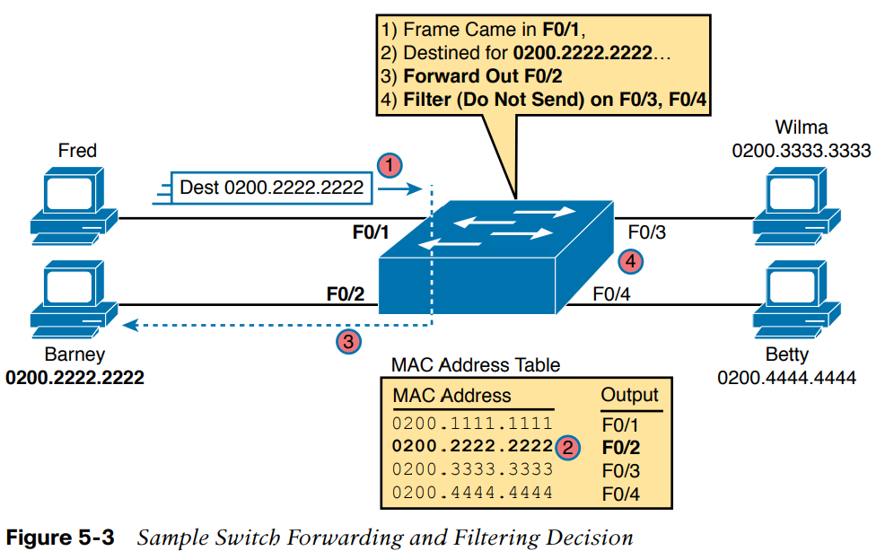
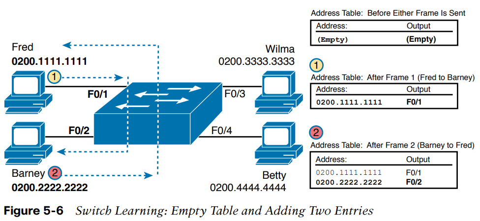
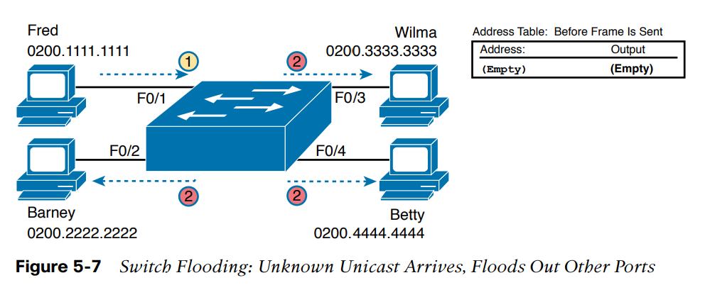
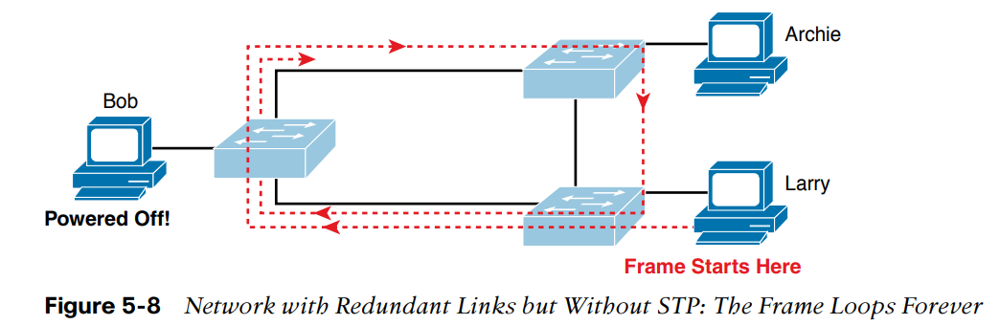

LAN switch nhận Ethernet frame và phải đưa ra quyết định:
- Chuyển tiếp frame 
- Hủy frame 

Để làm điều trên nó sẽ thực thi 3 nhiệm vụ:
1. Chuyển tiếp frame hoặc hủy frame dựa trên địa chỉ MAC đích 
2. Học các địa chỉ MAC bằng cách xem địa chỉ MAC nguồn của các frame nhận được
3. Sử dụng giao thức Spanning Tree để tránh lặp 

Switch có một bảng địa chỉ MAC lưu các địa chỉ MAC và cổng tương ứng 
- Có thể cấu hình bằng tay 
- Switch có thể tự động "học" các địa chỉ 

#### Quá trình học địa chỉ MAC 

Cứ khi nào nhận một frame có địa chỉ MAC đích không nằm trong bảng địa chỉ MAC, **quảng bá frame tới tất cả các cổng trừ cổng gửi**

#### Tránh vòng lặp sử dụng giao thức Spanning Tree 

Việc quảng bá frame sẽ khiến frame liên tục xoay vòng giữa 3 switch, và vì không switch nào có địa chỉ MAC của Bob trong bảng - mỗi switch sẽ lại quảng bá frame. Để tránh lặp tất cả các switch sử dụng **STP**. 

Tóm lại logic chuyển tiếp frame của switch như sau 

Bước 1: Switch chuyển tiếp frame dựa trên địa chỉ MAC đích 
  1. Nếu địa chỉ MAC là broadcast, multicast, hoặc unicast không biết (không có trong bảng MAC), switch sẽ quảng bá frame
  2. Nếu địa chỉ MAC là một địa chỉ đã biết (có trong bảng MAC)
     1. Nếu giao diện trong bảng MAC khác với giao diện nhận được frame, switch chuyển tiếp frame tới giao diện trong bảng MAC
     2. Nếu giao diện trong bảng MAC giống với giao diện mà frame được nhận, switch lờ frame và không chuyển tiế

Bước 2: Switch học địa chỉ MAC bằng cách xem địa chỉ MAC nguồn của mỗi frame nhận được nếu chưa có trong bảng thì lưu lại địa chỉ MAC và giao diện tương ứng. 

Bước 3: Các switch sử dụng STP để tránh lặp bằng cách chặn một vài cổng (ngăn không gửi hoặc nhận frame)