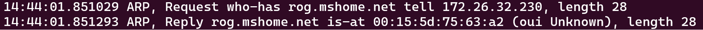

# TCPDUMP version 5.0.0

- [TCPDUMP version 5.0.0](#tcpdump-version-500)
  - [1. Cơ bản](#1-cơ-bản)
  - [2. Cài đặt](#2-cài-đặt)
    - [2.1 Linux](#21-linux)
    - [2.2 Windows](#22-windows)
    - [2.3 MacOS](#23-macos)
  - [3. Gọi tcpdump](#3-gọi-tcpdump)
  - [4. Lọc cơ bản](#4-lọc-cơ-bản)
  - [5. Đọc output của tcpdump](#5-đọc-output-của-tcpdump)
  - [6. Gọi tcpdump (tiếp tục)](#6-gọi-tcpdump-tiếp-tục)
    - [6.1 Lựa chọn giao diện](#61-lựa-chọn-giao-diện)
    - [6.2 Tắt phân giải tên](#62-tắt-phân-giải-tên)
    - [6.3 Giới hạn số lượng packet](#63-giới-hạn-số-lượng-packet)
    - [6.4 Lưu dữ liệu bắt được](#64-lưu-dữ-liệu-bắt-được)
    - [6.5 Thay đổi kích cỡ của packet trong file](#65-thay-đổi-kích-cỡ-của-packet-trong-file)
    - [6.5 Đọc từ file đã bắt được](#65-đọc-từ-file-đã-bắt-được)
  - [7. Các tùy chọn cho packet](#7-các-tùy-chọn-cho-packet)
    - [7.1 Xem Ethernet header cho mỗi packet](#71-xem-ethernet-header-cho-mỗi-packet)
    - [7.2 Định dạng thời gian](#72-định-dạng-thời-gian)
    - [7.3 Điều khiển độ chi tiết](#73-điều-khiển-độ-chi-tiết)
    - [7.4 In nội dung của packet](#74-in-nội-dung-của-packet)
  - [8. Lọc packet](#8-lọc-packet)
    - [8.1 Packet matching](#81-packet-matching)
    - [8.2 Các từ khóa định tính](#82-các-từ-khóa-định-tính)
    - [8.3 Đặc tả địa chỉ](#83-đặc-tả-địa-chỉ)
    - [8.4 Đặc tả độ dài packet](#84-đặc-tả-độ-dài-packet)
  - [9. Các biểu thức lọc phức tạp](#9-các-biểu-thức-lọc-phức-tạp)


## 1. Cơ bản 
- tcpdump là một công cụ bắt gói tin. 
- Có thể lưu các packet trong file, lưu cả packet hoặc chỉ header. (.cap)
- Có thể mở file đã lưu để phân tích 
- Là công cụ để debug các vấn đề liên quan tới mạng máy tính 
- Bên dưới sử dụng thư viên **libpcap**

## 2. Cài đặt 
### 2.1 Linux
Một vài distro có sẵn tcpdump

Nếu không có sử dụng packege manager để cài

### 2.2 Windows 

Windows không có tpcdump 

Một vài giải pháp thay thế 
- Wireshark 
- Pktmon (có sẵn trên windows)

### 2.3 MacOS
tcpdump mặc định có sẵn trên MacOS

## 3. Gọi tcpdump
- Phải là root hoặc là sudoer mới được phép sử dụng tcpdump
- Mặc định tcpdump sẽ bắt packet ở giao diện mạng có số hiệu thấp nhất ví dụ như eth0 (bỏ qua lo) 
- Nếu bạn sử dụng SSH để kết nối tới máy tính và chạy tcpdump, tcpdump sẽ cho ra một dòng text với mỗi packet vào hoặc ra. Dòng text này sẽ khiến SSH daemon gửi một packet với dòng này, khiến cho tcpdump sinh ra một dòng text nữa, và cứ thế lặp vô tận. 

## 4. Lọc cơ bản 

Để lọc các packet SSH và telnet, lọc các packet với IP nguồn hoặc đích có cổng 22 (cổng SSH). 
```
# tcpdump not port 22
```
Tương tự với telnet dùng cổng 23. 
```
# tcpdump not port 23
```

## 5. Đọc output của tcpdump 
- Mặc định tcpdump sinh ra một dòng text với mỗi packet nó bắt được. 

Thời gian | Tên giao thức | Địa chỉ đích và nguồn | Thông tin về packet (khác nhau tùy vào loại giao thức)



## 6. Gọi tcpdump (tiếp tục)
### 6.1 Lựa chọn giao diện 
Để bắt các packet đi ra vào một giao diện mạng sử dụng cờ **-i**
```
# tcpdump -i eth1 
```

Kết hợp với lọc SSH 
```
# tcpdump -i eth1 not port 22
```

Có thể dùng *any* thay vì tên giao diện, khiến tcpdump nghe tất cả các giao diện 
```
# tcpdump -i any not port 22
```
### 6.2 Tắt phân giải tên 
Mặc định tcpdump sẽ cố phân giải bất kì địa chỉ IP nào mà nó gặp (tcpdump yêu cầu DNS server cung cấp tên của địa chỉ IP mà nó gặp)

Có hai vấn đề cho hành vi trên 

1. Gây chậm việc bắt packet 
2. Nếu không có DNS server, hoặc DNS gặp lỗi. tcpdump sẽ dành ra một vài giây để tìm hostname cho mỗi IP packet, làm dừng quá trình bắt packet. 

Bật cờ **-n** để ngừng tìm hostname 

```
# tcpdump -n 
```
Kết hợp với các tùy chọn mà chúng ta đã biết 
```
# tcpdump -n -i eth1
# tcpdump -ni eth1 not port 22
```

### 6.3 Giới hạn số lượng packet
Sử dụng cờ **-c** để giới hạn packet
```
# tcpdump -c 10 
```
Khi tcpdump nhận được 10 packet nó sẽ dừng không bắt nữa


Kết hợp với các tùy chọn mà chúng ta đã biết 
```
# tcpdump -ni eth1 -c 10 not port 22
```

### 6.4 Lưu dữ liệu bắt được 
tcpdump cho phép lưu packet đi vào hoặc ra vào file

tcpdump có thể đọc file đó để "phát" lại quá trình bắt gói tin 

File này có thể được đọc bởi tcpdump để phân tích, hoặc đưa vào các chương trình phân tích packet khác như WireShark. 

Sử dụng cờ **-w** để lưu packet bắt được vào file 

```
# tcpdump -w file.cap 
```

Kết hợp với các tùy chọn mà chúng ta đã biết 
```
# tcpdump -ni eth1 -w file.cap not port 22
```

### 6.5 Thay đổi kích cỡ của packet trong file 
tcpdump phiên bản 5.0.0 mặc định bắt packet với độ dài tối đa là 262144 byte, bất kì packet nào có độ dài lớn hơn giới hạn trên sẽ bị cắt bớt

Các packet bị cắt bớt vì quá giới hạn sẽ có thêm phần `[|proto] `, trong đó **proto** là tên của tầng giao thức mà bị cắt bớt.

Để thay đổi độ dài tối đa bắt packet sử dụng
```
# tcpdump -s snaplen
# tcpdump --snapshot-length=snaplen
```

Đặt snaplen bằng 0 sẽ đăt nó thành độ dài mặc định 262144

*Lưu ý*: Nếu đặt snapshot length quá lớn thời gian để xử lý các packet tăng lên, có thể gây mất packet, nếu đặt snapshot length quá nhỏ dữ liệu từ các giao thức ở trên tầng transport có thể bị mất, mất đi thông tin quan trọng. 

### 6.5 Đọc từ file đã bắt được 
tcpdump có thể "phát lại" file đã bắt được 
```
# tcpdump -r file.cap 
```

## 7. Các tùy chọn cho packet 
tcpdump cung cấp nhiều tùy chọn để xem thông tin về packet, tuy nhiên tcpdump không biết nhiều giao thức 

Một công cụ khác để xem nội dung packet là Wireshark, nó hiểu các giao thức, phân tích chúng và cho phép bạn xem các trường khác nhau, không chỉ ở trong TCP header, mà các header của các giao thức ở tầng 7 

### 7.1 Xem Ethernet header cho mỗi packet 
Sử dụng cờ **-e**
```
# tcpdump -e -n not port 22
```

### 7.2 Định dạng thời gian 
- Cờ *-t*, khiến tcpdump bỏ qua thời gian 
- Cờ *-tt*, khiến tcpdump in ra thời gian dưới định dạng số giây kể từ khi 1/1/1970 . 
- Cờ *-ttt* in khoảng cách thời gian (micro giây hoặc nano giây tùy thuộc vào tùy chọn *--time-stamp-precision*) giữa dòng hiện tại và dòng ngay trước. Mặc định là micro giây 
- Cờ *-tttt* khiến tcpdump in thời gian dưới định dạng ngày, tháng, năm, giờ, phút, giây (thập phân) kể từ 0:00 
- Cờ *-ttttt* in khoảng cách thời gian  (micro giây hoặc nano giây tùy thuộc vào tùy chọn *--time-stamp-precision*) giữa dòng hiện tại và dòng đầu tiên. 

### 7.3 Điều khiển độ chi tiết 
- Cờ *-v* khiến tcpdump in ra nhiều thông tin hơn. Ví dụ như time to live,...
- Cờ *-vv* khiến tcpdump in ra nhiều thông tin hơn nữa. Ví dụ, các trường trong packet reply của NFS được in ra,...
- Cờ *-vvv* khiến tcpdump in ra nhiều thông tin nữa nữa, ví dụ các tùy chọn **SB..SE** của telnet được in ra đầy đủ

### 7.4 In nội dung của packet 
- Cờ *-x* khiến tcpdump in thêm phần data của mỗi packet dưới dạng hex (ngoại trừ phần header của tầng data-link i.e Ethernet).
- Cờ *-xx* tương tự như *-x* nhưng có in cả data của tầng data-link 
- Cờ *-X*, tương tự như *-x*, nhưng in thêm định dạng ASCII 
- Cờ *-XX*, tương tự như *-X*, nhưng in cả data của tầng data-link 

## 8. Lọc packet

### 8.1 Packet matching 
- tcpdump sử dụng bộ lọc của chúng ta trên mỗi packet đi vào/ra. 
    - Nếu packet match với filter, tcpdump chấp nhận packet 
    - Nếu nó không thì tcpdump lờ packet, và chỉ tính khi thông báo cho người dùng nó nhận được bao nhiêu packet. 

### 8.2 Các từ khóa định tính 

Sử dụng *src port* hoặc *dsst port* để đặc tả port nguồn hoặc đích 

Ví dụ, biểu thức dưới sẽ bắt tất cả các packet HTTP đi ra 

```
# tcpdump -n src port 80 
```

Có thể đặc tả khoảng các ports. *portrange*, *src portrange* và *dst portrange*. 
Ví dụ, câu lệnh bắt tất cả packet telnet và SSH
```
# tcpdump -n portrange 22-23
```

### 8.3 Đặc tả địa chỉ 
Sử dụng *dst host*, *src host* để đặc tả nguồn, đích của bất kì địa chỉ IP. Ví dụ câu lệnh dưới in tất cả packet đi từ alexandersandler.net
```
# tcpdump src host alexandersandler.net
```

Sử dụng *ether src, ether dst* và *ether host*

Sử dụng *net, src net* và *dst net* để đặc tả địa chỉ mạng 

Sử dụng hai cách đặc tả
```
# tcpdump src net 67.208.148.0 mask 255.255.255.0
```

```
# tcpdump src net 67.207.148.0/24
```

### 8.4 Đặc tả độ dài packet 
Sử dụng *less* và *greater* để lọc packet có độ dài lớn hơn hoặc nhỏ hơn giá trị được đặc tả 

Ví dụ
```
# tcpdump -ni eth1 greater 1000
```
Chỉ bắt các packet có kích cỡ lớn hơn 1000 bytes. 

## 9. Các biểu thức lọc phức tạp 
- not: phủ định biểu thức
- and: đúng khi cả hai biểu thức đúng 
- or: đúng khi một trong hai biểu thức đúng 

Ví dụ, câu lệnh tcpdump dưới sẽ khiến tcpdump bắt packet lớn hơn 100 bytes từ google.com hoặc từ microsoft.com

```
# tcpdump -XX greater 100 and \(src host google.com or src host microsoft.com\)
```

*Lưu ý:* not có độ ưu tiên cao hơn and và or, tức là 
```
not host vs and host ace
```
khác với 
```
not (host vs or host ace)
```