# 1. Socket address structure 
- Phần lớn chức năng socket cần con trỏ tới struct socket address làm tham số 

## 1.1 Ipv4 Socket Address Structure 
```
struct in_addr {
    in_addr_t s_addr;       /* 32 bit IPv4 address */
                            /* network byte ordered */
};

struct sockaddr_in {
    uint8_t         sin_len;    /* length of structure */
    sa_familty_t    sin_family; /* AF_INET */
    in_port_t       sin_port;   /* 16-bit TCP or UDP port number */
    struct in_addr  sin_addr;   /* 32-bit IPv4 address */
                                /* network byte ordered */
    char            sin_zero[8];/* unused */
};

```

Trường sin_len không được sử dụng bởi người lập trình trừ khi xử lý routing socket, nó có thể được sử dụng bởi kernel. 

Trường sin_zero để padding cho struct lên 16 byte

POSIX chỉ cần quan tâm tới 3 trường
- sin_family
- sin_addr
- sin_port

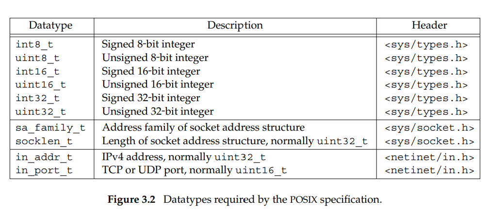

- Địa chỉ IPv4 và số hiệu cổng TCP và UDP luôn được lưu bên trong struct dưới thứ tự network byte, chúng ta sẽ bàn về sự khác biệt giữa thứ tự host byte và network byte sau. 
- Địa chỉ IPv4 có thể được truy cập thông qua hai cách. Ví dụ, nếu *serve* được định nghĩa là một struct Internet socket address, thì *serv.sin_addr* tham chiếu tới địa chỉ IPv4 là một structure *in_addr*, trong khi đó *serv.sin_addr.s_addr* tham chiếu tới cùng địa chỉ IPv4 với kiểu dữ liệu là *in_addr_t* (thường là 32-bit unsigned integer). Phải cẩn thận khi tham chiếu địa chỉ IPv4, vì có sự khác biệt giữa cách compiler truyền struct và integer. 
- Socket address structure chỉ được dùng trên host: nó không được truyền qua lại giữa các hosts khác nhau, mặc dù trường của nó (IP address và port được dùng cho giao tiếp)

## 1.2 Socket Address Structure tổng quát

Socket address structure luôn được truyền qua tham chiếu khi nó làm tham số của các hàm socket. 

Vấn đề: Bất kì hàm socket nhận con trỏ tới socket address structure phải xử lý socket address structure từ bất kì giao thức được hỗ trợ

Giải pháp: ANSI C sử dụng _void *_. Các hàm socket lại có trước ANSI C, và giải pháp được chọn vào năm 1982 là định nghĩa một struct socket address *tổng quát*

```
struct sockaddr {
    uint8_t sa_len;
    sa_family_t sa_family;  /* address family: AF_xxx value */
    char sa_data[14]; /* protocol-specific address */
}
```
Các hàm socket sẽ được định nghĩa nhận con trỏ tới struct socket address tổng quát 

```
int bind(int, struct sockaddr *, socklen_t);
```

Nên bất kì lời gọi hàm nào phải ép kiểu con trỏ thành struct socket address tổng quát 

```
struct sockaddr_in serv; /* IPv4 socket address structure */

bind(sockfd, (struct socketaddr *) &serv, sizeof(serv));
```

Ngoài ra còn có sockaddr_storage là socket address structure tổng quát mới để hỗ trợ được IPv6.  

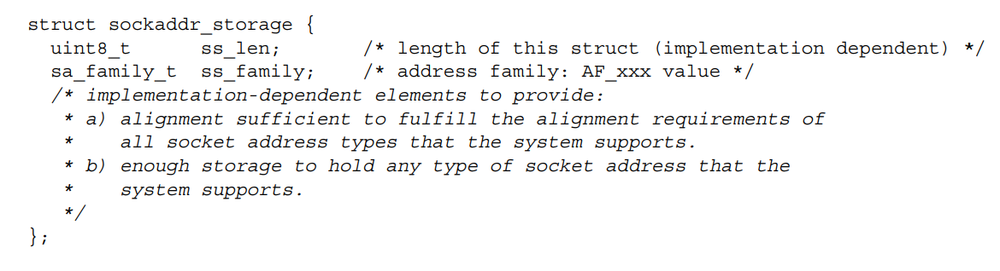

## 1.3 So sánh các socket address structures 

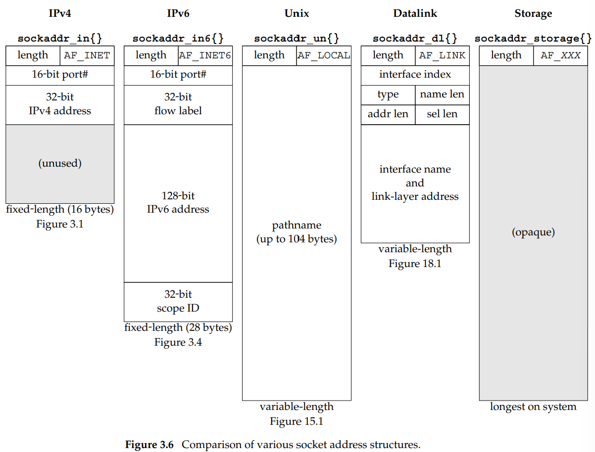

# 2. Tham số Value-Result 

Khi truyền socket address structure, độ dài của struct cũng được truyền. Chiều mà nó được truyền tùy thuộc vào chiều mà structure được truyền: từ tiến trình tới kernel, hay ngược lại

## 2.1 Từ tiến trình tới kernel
Các hàm bind, connect, và sendto truyền socket address structure từ tiến trình tới kernel. Các hàm này có tham số là độ dài của structure, giúp kernel biết được chính xác đọ dài dữ liệu được sao chép từ tiến trình vào kernel

```
struct sockaddr_in serv;

connect(sockfd, (SA *) &serv, sizeof(serv));
```

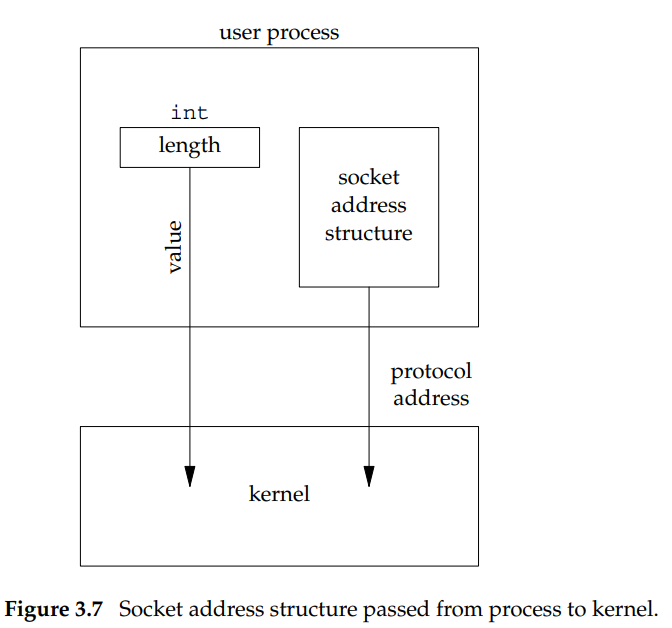

## 2.2 Từ kernel tới tiến trình
Bốn hàm accept, recvfrom, getsockname, và getpeername, truyền socket address structure từ kernel tới tiến trình. Các hàm đều có một tham số là con trỏ tới độ dài của socket address struct, giá trị của nó vừa được dùng làm tham số để hàm xử lý (bảo kernel độ dài của structure để kernel không viết quá structure), vừa được dùng làm giá trị trả về (hàm có thể thay đổi giá trị)

```
struct sockaddr_un cli; /* Unix domain */

socklen_t len;
len = sizeof(cli);

getpeername(unixfd, (SA *) &cli, &len);
/* len may have changed */
```
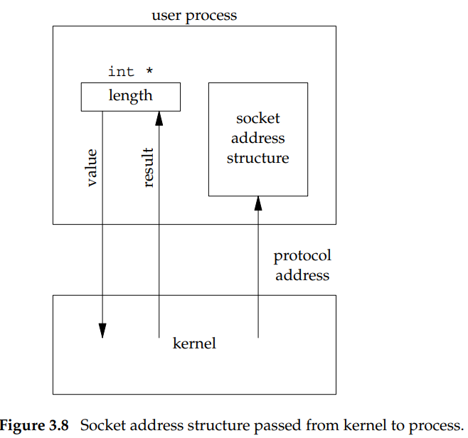

**Lưu ý**: Tùy vào cài đặt, ví dụ như với 4.4BSD, các socket functions là syscall bên trong kernel, nhưng với System V, các hàm socket chỉ là các hàm thư viện chạy dưới tiến trình người dùng. 

#  3. Byte Ordering 
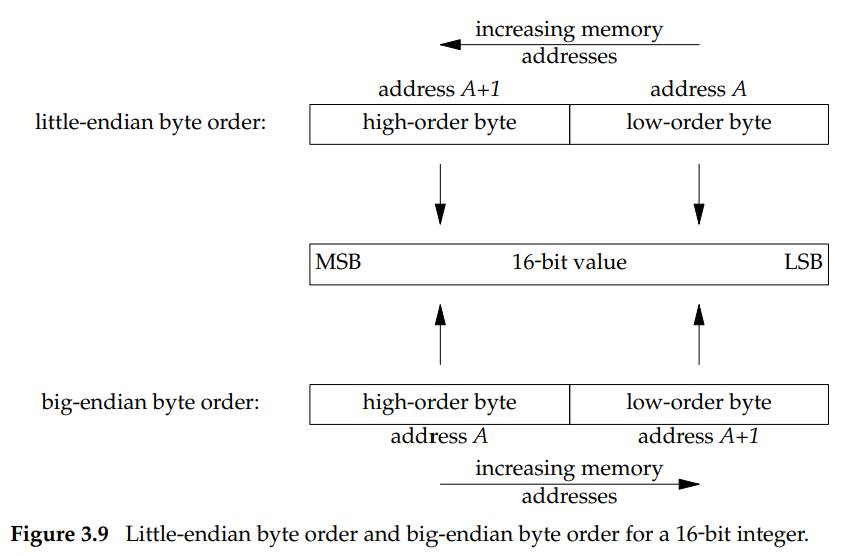

Byte ordering dùng bởi một hệ thống là *host byte order*

Ví dụ: trên máy linux 
```
# lscpu | grep Endian
Byte Order:             Little Endian
```
Byte ordering sử dụng bởi giao thức là *network byte order*

Ví dụ: trong một TCP segment, có số hiệu cổng 16-bit và địa chỉ 32-bit IPv4. Stack truyền và stack nhận phải đồng thuận sử dụng order nào. Các giao thức Internet sử dụng big-endian byte ordering cho những số trên. 

Vấn đề: Phải chuyển giữa host byte order và network byte order. 

Giải pháp: netinet cung cấp các hàm để chuyển đổi 

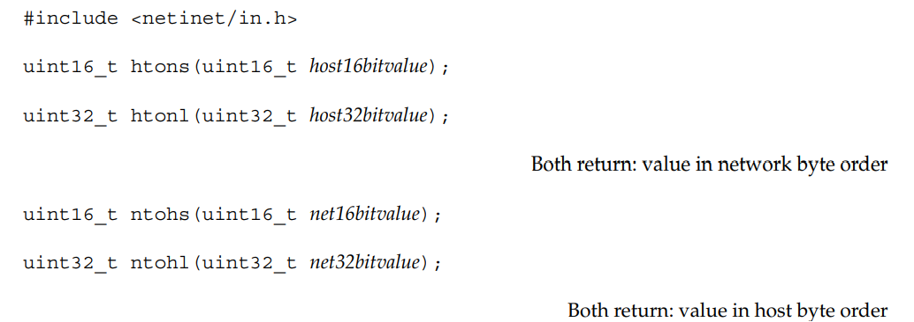

# 4. Hàm thực thi trên byte. 

Hình như bị deprecated 
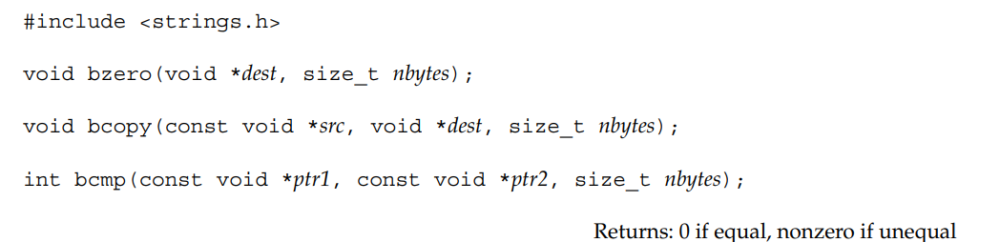

ANSI C (giờ là ISO C):
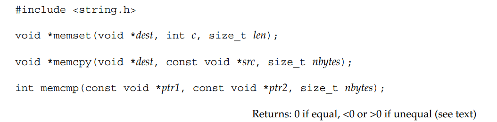

# 5. inet_aton, inet_addr, và inet_ntoa, inet_pton, inet_ntop

Các hàm trong phần này chuyển địa chỉ Internet dưới dạng xâu ASCII (con người rất thích) và các giá trị network byte (giá trị được lưu trong socket address structures)

1. inet_aton, inet_ntoa, và inet_addr chuyển địa chỉ IPv4 từ kí pháp xâu với dấu "." ("192.168.1.1") thành giá trị nhị phân 32-bit
2. Các hàm mới inet_pton, inet_ntop, xử lý được cả IPv4 và IPv6.*in_addr*

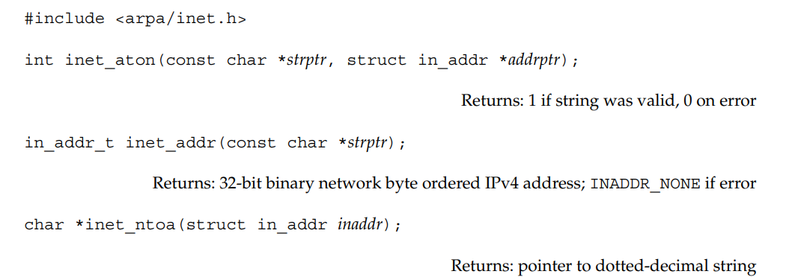

Lưu ý: Hàm inet_addr không xử lý được địa chỉ 255.255.255.255 vì nó sử dụng 32 bit toàn 1 để báo lỗi (cũng tùy thuộc vào compiler sử dụng nói chung là không dùng cái này và nó cũng bị deprecated), chỉ nên dùng inet_aton, tốt hơn nữa thì dùng hàm mới xử lý được cả IPv4 và IPv6. 

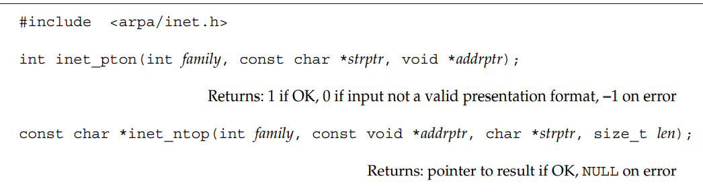

Tổng quát hóa 

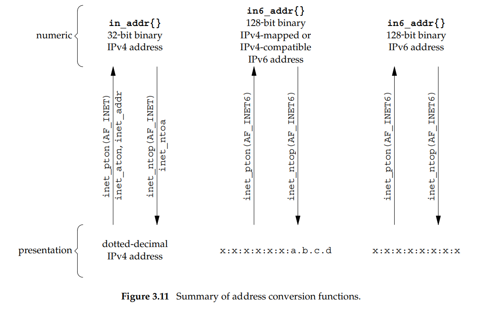

# 6. sock_ntop và các hàm liên quan 

Vấn đề: inet_ntop yêu cầu người gọi truyền con trỏ tới địa chỉ nhị phân (không phải địa chỉ bộ nhớ địa chỉ IPv4 dưới dạng nhị phân). Địa chỉ này thường được chứa bên trong socket address structure, người gọi cần biết định dạng của structure và address family của structure đó. Tức là chúng ta phải viết 
```
struct sockaddr_in addr;
inet_ntop(AF_INET, &addr.sin_addr, str, sizeof(str));

struct sockaddr_in6 addr6;
inet_ntop(AF_INET6, &addr6.sin6_addr, str, sizeof(str));
```
Để giải quyết vấn đề trên chúng ta có thể tự viết một hàm tên *sock_ntop* hàm này sẽ nhìn vào bên trong structure và gọi hàm phù hợp. 

(Phần này còn nữa nhưng không làm)

# 7 readn, writen, và readline 

Hàm tự cài để giải quyết vấn đề của hàm write, read trên stream socket (TCP sockets). 

(Phần này còn nữa nhưng không làm)


